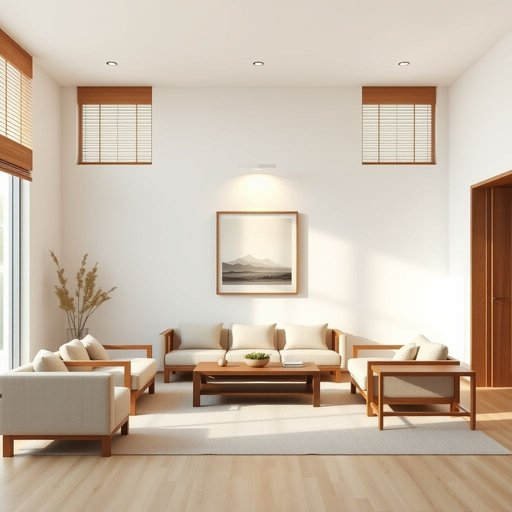

# light

<h1 style="font-size: 2.5em; font-weight: 300; letter-spacing: 2px; margin: 0; color: #2c3e50;">
/laɪt/
</h1>

---

---

## 例句

Could you please turn on the light in the living room, which is the one with the dimmer switch by the door, so that we can have a better look at the new painting before deciding where to hang it?

*Could(/kʊd/) you(/ju/) please(/pliz/) turn(/tərn/) on(/ɔn/) the(/ðə/) light(/laɪt/) in(/ɪn/) the(/ðə/) living(/ˈlɪvɪŋ/) room,(/rum,/) which(/wɪʧ/) is(/ɪz/) the(/ðə/) one(/wən/) with(/wɪθ/) the(/ðə/) dimmer(/ˈdɪmər/) switch(/swɪʧ/) by(/baɪ/) the(/ðə/) door,(/dɔr,/) so(/soʊ/) that(/ðət/) we(/wi/) can(/kən/) have(/hæv/) a(/ə/) better(/ˈbɛtər/) look(/lʊk/) at(/æt/) the(/ðə/) new(/nu/) painting(/ˈpeɪnɪŋ/) before(/ˌbiˈfɔr/) deciding(/ˌdɪˈsaɪdɪŋ/) where(/wɛr/) to(/tɪ/) hang(/hæŋ/) it?(/ɪt?/)*

**翻译：** 您能否打开客厅的灯，就是门边带有调光开关的那盏灯，这样我们就能更好地欣赏这幅新画，然后再决定挂在哪里？

---

## 解释

英语单词“light”作为名词在家居生活用品的语境中，主要指“灯光”或“照明设备”，例如台灯、吊灯、壁灯等发出光线的物品。当人们谈论房间的“light”时，通常指的是房间中的光源或整体照明情况，比如“turn on the light”（开灯）、“the living room needs more light”（客厅需要更多光线）。学习者使用时需注意“light”作为名词时不可数表明光线本身，也可作为可数名词指具体的灯具，如a light on the ceiling（天花板上的灯）。常见搭配包括“light fixture”（灯具）、“ceiling light”（顶灯）、“natural light”（自然光）以及“light bulb”（灯泡）等；表达时要区分“light”与“lamp”，前者常泛指光线和灯具，后者特指灯具。词源方面，“light”源自古英语“lēoht”，与德语“Licht”和荷兰语“licht”等同源，原指自然的光亮，后来引申为人工光源及其发出的光。中文中通常翻译为“灯光”或“灯”，视具体语境而定，例如“turn off the light”翻译为“关灯”，“the light in the room is bright”翻译为“房间里的灯光很亮”。此外，“light”在日常家居中没有明显褒贬含义，但在描述光线质量时可能带有主观色彩，比如“soft light”表示柔和的灯光，暗示温馨舒适的氛围。总体而言，理解“light”在家居语境中的具体指代及搭配习惯，有助于准确表达与灯光相关的需求和描写。

---

<small style="color: #999; font-size: 0.9em;">2025-07-17 06:22:40</small>

