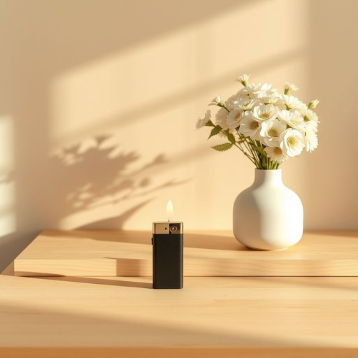

# lighter

<h1 style="font-size: 2.5em; font-weight: 300; letter-spacing: 2px; margin: 0; color: #2c3e50;">
/ˈlaɪtər/
</h1>

---

---

## 例句

The lighter on the kitchen counter next to the vase with fresh flowers is essential for lighting the candles before our guests arrive this evening.

*The(/ðə/) lighter(/ˈlaɪtər/) on(/ɔn/) the(/ðə/) kitchen(/ˈkɪʧən/) counter(/ˈkaʊntər/) next(/nɛkst/) to(/tɪ/) the(/ðə/) vase(/vɑz/) with(/wɪθ/) fresh(/frɛʃ/) flowers(/flaʊərz/) is(/ɪz/) essential(/ɛˈsɛnʃəl/) for(/fər/) lighting(/ˈlaɪtɪŋ/) the(/ðə/) candles(/ˈkændəlz/) before(/ˌbiˈfɔr/) our(/ɑr/) guests(/gɛsts/) arrive(/əraɪv/) this(/ðɪs/) evening.(/ˈivnɪŋ./)*

**翻译：** 放在厨房柜台上、鲜花花瓶旁的打火机，是在今晚客人到来之前点燃蜡烛的必备工具。

---

## 解释

英语单词'lighter'作为名词在家居生活用品的语境中，指的是一种用于点火的小型工具，通常是打火机，常见于点燃香烟、蜡烛、煤气炉或壁炉等场合。英语学习者在使用‘lighter’时需要注意其作为名词时的单复数形式为‘lighters’，此外，它也可以是形容词'light'的比较级形式，但在家居用品语境中应区别开来。常见搭配包括“a lighter for candles”（点蜡烛用的打火机）、“a refillable lighter”（可加油打火机）等，表达时需注意区分‘lighter’作为物品与‘lighter’比较级含义的不同。词源方面，‘lighter’来源于动词‘light’的派生名词，原意指能“点燃火光的装置”，该词最早出现于19世纪随着便携点火装置的发展而普及。在中文语境中，‘lighter’通常被准确翻译为“打火机”，这一翻译既具体又形象，符合中国家庭生活中的实际用法，没有褒贬色彩，属于中性名词，文化内涵较为普遍，不涉及特殊的情感或社会评价。总的来说，理解‘lighter’的确切含义及正确用法，有助于英语学习者准确表达与日常生活密切相关的点火工具。

---

<small style="color: #999; font-size: 0.9em;">2025-07-17 06:22:40</small>

