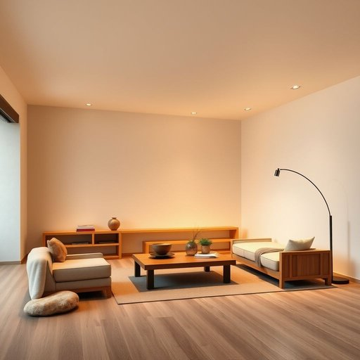

# lighting

<h1 style="font-size: 2.5em; font-weight: 300; letter-spacing: 2px; margin: 0; color: #2c3e50;">
/ˈlaɪtɪŋ/
</h1>

---

---

## 例句

The lighting in the living room, combining dimmable recessed spotlights and elegant floor lamps, not only creates a warm and inviting atmosphere for evening gatherings but also allows adjustment of brightness depending on whether guests are being hosted or a book is being enjoyed in relaxation.

*The(/ðə/) lighting(/ˈlaɪtɪŋ/) in(/ɪn/) the(/ðə/) living(/ˈlɪvɪŋ/) room,(/rum,/) combining(/kəmˈbaɪnɪŋ/) dimmable(/dimmable*/) recessed(/ˈriˈsɛst/) spotlights(/ˈspɑˌtlaɪts/) and(/ənd/) elegant(/ˈɛləgənt/) floor(/flɔr/) lamps,(/læmps,/) not(/nɑt/) only(/ˈoʊnli/) creates(/kriˈeɪts/) a(/ə/) warm(/wɔrm/) and(/ənd/) inviting(/ˌɪnˈvaɪtɪŋ/) atmosphere(/ˈætməsˌfɪr/) for(/fər/) evening(/ˈivnɪŋ/) gatherings(/ˈgæðərɪŋz/) but(/bət/) also(/ˈɔlsoʊ/) allows(/əˈlaʊz/) adjustment(/əˈʤəstmənt/) of(/əv/) brightness(/ˈbraɪtnəs/) depending(/dɪˈpɛndɪŋ/) on(/ɔn/) whether(/ˈwɛðər/) guests(/gɛsts/) are(/ər/) being(/biɪŋ/) hosted(/ˈhoʊstɪd/) or(/ər/) a(/ə/) book(/bʊk/) is(/ɪz/) being(/biɪŋ/) enjoyed(/ˌɛnˈʤɔɪd/) in(/ɪn/) relaxation.(/ˌrilækˈseɪʃən./)*

**翻译：** 客厅的照明结合了可调光的嵌入式射灯和雅致的落地灯，不仅营造出温馨宜人的氛围，适合晚间聚会，也能够根据招待宾客或静心阅读的不同需求调节光线明暗。

---

## 解释

英语单词“lighting”作为名词在家居生活用品语境中主要指的是“照明”或“灯具”，即与室内或室外空间中光线的布置、设计和设备有关的内容。具体使用场合通常包括描述房间的光线效果、讨论灯具的种类与安装、或者谈论如何利用光线营造环境氛围，例如“the lighting in the living room is very warm and cozy”（客厅的照明很温馨舒适）。英语学习者需要注意的是，“lighting”作为名词是不可数名词，通常不直接与复数形式连用，其常见搭配有“lighting system”（照明系统）、“lighting fixture”（灯具）、“natural lighting”（自然光）、“ambient lighting”（环境照明）等，且常与形容词连用来描述光的性质，如“bright lighting”（明亮的照明）、“dim lighting”（昏暗的照明）。此外，动词“light”及其派生词“lighting”在语法中也有作动名词用法，但在家居环境中多指名词用法。词源方面，“lighting”源自古英语“lighten”的现在分词形式，原意为“点亮”，后来引申为“照明”，反映了从动作到状态的转变。在中文语境中，准确的翻译为“照明”或“灯具”，强调的是通过人工或自然手段提供光线的功能或设备，通常不含有特别的褒义或贬义，属于中性词汇，然而在设计和装修语境中提到“lighting”往往关联着舒适、美观和功能性，具有积极的文化含义，体现出对生活品质的追求。

---

<small style="color: #999; font-size: 0.9em;">2025-07-17 06:22:40</small>

