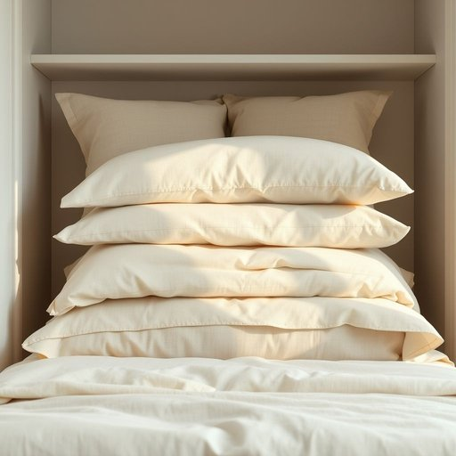

# linen

<h1 style="font-size: 2.5em; font-weight: 300; letter-spacing: 2px; margin: 0; color: #2c3e50;">
/ˈlɪnən/
</h1>

---

---

## 例句

Could you please check if the fresh linen, including the pillowcases and duvet covers that I neatly folded yesterday after washing, has been put away in the guest room cupboard before we set the table for dinner?

*Could(/kʊd/) you(/ju/) please(/pliz/) check(/ʧɛk/) if(/ɪf/) the(/ðə/) fresh(/frɛʃ/) linen,(/ˈlɪnən,/) including(/ˌɪnˈkludɪŋ/) the(/ðə/) pillowcases(/pillowcases*/) and(/ənd/) duvet(/duvet*/) covers(/ˈkəvərz/) that(/ðət/) I(/aɪ/) neatly(/ˈnitli/) folded(/ˈfoʊldɪd/) yesterday(/ˈjɛstərˌdeɪ/) after(/ˈæftər/) washing,(/ˈwɑʃɪŋ,/) has(/həz/) been(/bɪn/) put(/pʊt/) away(/əˈweɪ/) in(/ɪn/) the(/ðə/) guest(/gɛst/) room(/rum/) cupboard(/ˈkəbərd/) before(/ˌbiˈfɔr/) we(/wi/) set(/sɛt/) the(/ðə/) table(/ˈteɪbəl/) for(/fər/) dinner?(/ˈdɪnər?/)*

**翻译：** 请问您能否确认一下，昨天我洗完衣服后整齐叠好的新床品，包括枕套和被套，是否已被收纳进客房的衣柜里？我们准备摆晚餐餐具前需要确认此事。

---

## 解释

英语单词“linen”作为名词在家居生活用品的语境中，主要指用亚麻纤维制成的布料及其制品，常见于床单、桌布、餐巾、枕套等家用纺织品。具体使用场合多见于描述卧室或餐厅的织物用品，如“change the linen”（更换床单）、“table linen”（餐桌布）等。英语学习者需要注意的是，“linen”作为不可数名词时，通常泛指这类织物或织物制品的总称，且不可直接加复数形式，但在某些情境中，如指多件具体物品时，也可用复数形式“linens”表示多件亚麻制家居用品。此外，常见搭配包括“bed linen”（床上用品）、“bath linen”（浴室用布）、“fresh linen”（干净的床单等），表达时往往与形容词或量词连用以限定具体种类和数量。词源方面，“linen”源自中古英语，最初指亚麻织物，其根源来自拉丁语“linum”，即亚麻，暗示其天然纤维属性，反映了这种织物的天然和耐用特性。在中文语境中，“linen”准确翻译为“亚麻布”或泛指“床单、桌布等亚麻制家居用品”，但更多时候根据上下文意译为“床单”、“床上用品”或“桌布”等，强调其实用属性。需要特别指出的是，“linen”在家居用语中无褒贬色彩，属于中性词，文化内涵侧重于其传统与自然质感，体现一种朴素、舒适的生活品味。

---

<small style="color: #999; font-size: 0.9em;">2025-07-17 06:22:40</small>

