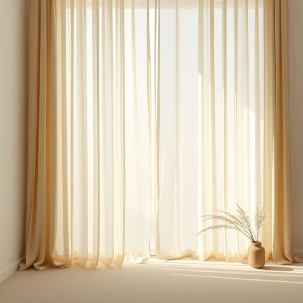

# lining

<h1 style="font-size: 2.5em; font-weight: 300; letter-spacing: 2px; margin: 0; color: #2c3e50;">
/ˈlaɪnɪŋ/
</h1>

---

---

## 例句

Before you decide to donate those old curtains, remember that the delicate lining, which not only helps to keep out the draught but also protects the fabric from fading in the sunlight, might make them worth keeping for a second use in another room.

*Before(/ˌbiˈfɔr/) you(/ju/) decide(/ˌdɪˈsaɪd/) to(/tɪ/) donate(/ˈdoʊˌneɪt/) those(/ðoʊz/) old(/oʊld/) curtains,(/ˈkərtənz,/) remember(/rɪˈmɛmbər/) that(/ðət/) the(/ðə/) delicate(/ˈdɛləkət/) lining,(/ˈlaɪnɪŋ,/) which(/wɪʧ/) not(/nɑt/) only(/ˈoʊnli/) helps(/hɛlps/) to(/tɪ/) keep(/kip/) out(/aʊt/) the(/ðə/) draught(/dræft/) but(/bət/) also(/ˈɔlsoʊ/) protects(/prəˈtɛkts/) the(/ðə/) fabric(/ˈfæbrɪk/) from(/frəm/) fading(/ˈfeɪdɪŋ/) in(/ɪn/) the(/ðə/) sunlight,(/ˈsənˌlaɪt,/) might(/maɪt/) make(/meɪk/) them(/ðɛm/) worth(/wərθ/) keeping(/ˈkipɪŋ/) for(/fər/) a(/ə/) second(/ˈsɛkənd/) use(/juz/) in(/ɪn/) another(/əˈnəðər/) room.(/rum./)*

**翻译：** 在决定捐赠那些旧窗帘之前，请记住，窗帘上那层精致的衬里不仅有助于挡风，还能防止布料在阳光下褪色，这些都可能使它们值得留作他用，比如在另一个房间继续使用。

---

## 解释

在家居生活用品的语境中，名词“lining”通常指某物内部的衬里或内衬，常见于衣物、窗帘、家具如沙发或衣柜内壁，以及一些家居用品如被子、包袋里层，用以增强结构、提供保护或改善手感和耐用性。例如，一件外套的lining可以是光滑的布料，使穿着更舒适，窗帘的lining则能起到遮光或隔热的功能。英语学习者使用“lining”时需注意它通常作为可数名词出现，有时候也可作为不可数名词，且常与表示具体物品的名词搭配，如“jacket lining”（夹克内衬）、“curtain lining”（窗帘内衬）、“lining fabric”（衬里布料），使用时常见的表达为“a lining of something”或“the lining inside something”。另外，“lining”与“shell”（外层）一词相对，常在描述多层结构时出现。在词源上，“lining”来自中世纪英语“line”加上后缀“-ing”，原意指在某物内部铺设或覆盖一层面料，用以“限定、覆盖”的意义延伸至现代。中文语境中，“lining”准确翻译为“衬里”或“内衬”，强调的是覆盖在物体内部的那层材料，且一般无褒贬色彩，属于中性词汇，纯粹描述结构特征。在文化层面上，lining的质量往往关系到家居用品的舒适度和耐用性，体现了制作工艺的细致与用心，因此在家居用品领域“lining”隐含着品质和实用性的考量。

---

<small style="color: #999; font-size: 0.9em;">2025-07-17 06:22:40</small>

