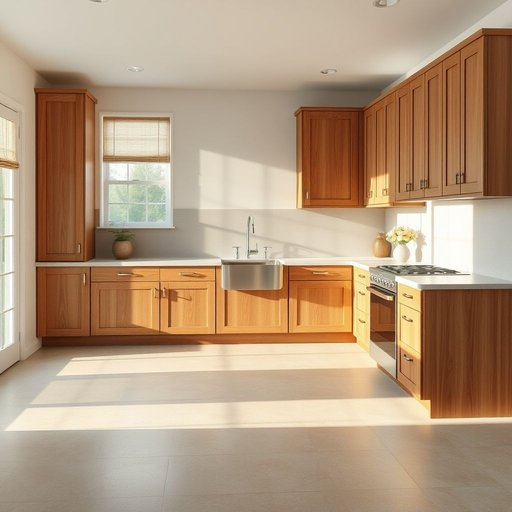

# linoleum

<h1 style="font-size: 2.5em; font-weight: 300; letter-spacing: 2px; margin: 0; color: #2c3e50;">
/ləˈnoʊliəm/
</h1>

---

---

## 例句

I decided to replace the old, worn-out carpet in the kitchen with linoleum, which not only offers a more durable and stain-resistant surface but also comes in a variety of patterns that perfectly complement the vintage cupboards and the newly installed stainless steel sink.

*I(/aɪ/) decided(/ˌdɪˈsaɪdɪd/) to(/tɪ/) replace(/ˌriˈpleɪs/) the(/ðə/) old,(/oʊld,/) worn-out(/worn-out*/) carpet(/ˈkɑrpət/) in(/ɪn/) the(/ðə/) kitchen(/ˈkɪʧən/) with(/wɪθ/) linoleum,(/ləˈnoʊliəm,/) which(/wɪʧ/) not(/nɑt/) only(/ˈoʊnli/) offers(/ˈɔfərz/) a(/ə/) more(/mɔr/) durable(/ˈdʊrəbəl/) and(/ənd/) stain-resistant(/stain-resistant*/) surface(/ˈsərfəs/) but(/bət/) also(/ˈɔlsoʊ/) comes(/kəmz/) in(/ɪn/) a(/ə/) variety(/vərˈaɪəti/) of(/əv/) patterns(/ˈpætərnz/) that(/ðət/) perfectly(/ˈpərfəktli/) complement(/ˈkɑmpləmənt/) the(/ðə/) vintage(/ˈvɪntɪʤ/) cupboards(/ˈkəbərdz/) and(/ənd/) the(/ðə/) newly(/ˈnuli/) installed(/ˌɪnˈstɔld/) stainless(/ˈsteɪnləs/) steel(/stil/) sink.(/sɪŋk./)*

**翻译：** 我决定用塑胶地板替换厨房里旧的、磨损的地毯，这不仅提供了更耐用且防污的表面，还有多种图案可选，完美衬托出复古橱柜和新安装的不锈钢水槽。

---

## 解释

英语单词"linoleum"作为名词，主要指一种用于铺设地面的材料，通常由亚麻籽油、松香、木粉及颜料等混合制成，表面较为坚固且易于清洁，常见于厨房、浴室和其他需要耐磨、防水的室内空间。在家居生活用品的语境中，"linoleum"多用于描述地板覆盖物，强调其经济耐用和维护方便的特点。英语学习者在使用该词时应注意它是不可数名词，表示材料整体时一般不使用复数形式，但在特定情况下若指多种款式或几片地板也可使用复数形式“linoleums”。搭配方面常见表达有"linoleum floor"（亚麻油地板）、"install linoleum"（安装亚麻油地板）、"linoleum sheet"（亚麻油地板片）等。语法上，"linoleum"作为名词可直接作主语、宾语或表语，但需避免与瓷砖或木地板等概念混淆。该词源于19世纪中叶，由拉丁语“linea”（线条）和希腊语“oleum”（油）组合而成，反映其原材料为亚麻籽油的特点，最早由英国人Frederick Walton发明用于替代传统地板材料。在中文语境中，"linoleum"准确翻译为“亚麻油地板”或简称“塑胶地板”，但现代家庭装修中更普遍的理解是广义的塑胶地板材质，并不特指原始含亚麻油成分的老式材料。该词在文化上较为中性，常用于描述经济实用的地板选择，没有明显的褒贬含义，但在现代家庭装修中，"linoleum"可能被视为较传统或老式的材料，与现代高端复合地板有所区别。总之，理解"linoleum"需结合其材料性能、使用场合及历史背景，准确传达为室内耐磨防水的地面覆盖物。

---

<small style="color: #999; font-size: 0.9em;">2025-07-17 06:22:40</small>

