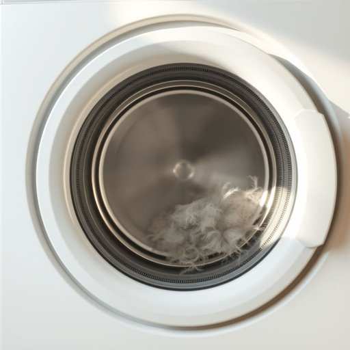

# lint

<h1 style="font-size: 2.5em; font-weight: 300; letter-spacing: 2px; margin: 0; color: #2c3e50;">
/lɪnt/
</h1>

---

---

## 例句

After doing the laundry, I noticed that despite using the softener, the dryer drum was still covered in a fine layer of white lint, which not only clung stubbornly to all my dark clothes but also threatened to clog the vent if I didn’t clean it out thoroughly before the next load.

*After(/ˈæftər/) doing(/duɪŋ/) the(/ðə/) laundry,(/ˈlɔndri,/) I(/aɪ/) noticed(/ˈnoʊtɪst/) that(/ðət/) despite(/dɪˈspaɪt/) using(/ˈjuzɪŋ/) the(/ðə/) softener,(/ˈsɔfənər,/) the(/ðə/) dryer(/draɪər/) drum(/drəm/) was(/wɑz/) still(/stɪl/) covered(/ˈkəvərd/) in(/ɪn/) a(/ə/) fine(/faɪn/) layer(/leɪər/) of(/əv/) white(/waɪt/) lint,(/lɪnt,/) which(/wɪʧ/) not(/nɑt/) only(/ˈoʊnli/) clung(/kləŋ/) stubbornly(/ˈstəbərnli/) to(/tɪ/) all(/ɔl/) my(/maɪ/) dark(/dɑrk/) clothes(/kloʊðz/) but(/bət/) also(/ˈɔlsoʊ/) threatened(/θˈrɛtənd/) to(/tɪ/) clog(/klɑg/) the(/ðə/) vent(/vɛnt/) if(/ɪf/) I(/aɪ/) didn’t(/didn’t*/) clean(/klin/) it(/ɪt/) out(/aʊt/) thoroughly(/ˈθəroʊli/) before(/ˌbiˈfɔr/) the(/ðə/) next(/nɛkst/) load.(/loʊd./)*

**翻译：** 洗完衣服后，我注意到尽管使用了柔顺剂，烘干机的滚筒仍然覆盖着一层细密的白色绒毛，这些绒毛不仅顽固地附着在我所有的深色衣物上，如果我不在下一次烘干前彻底清理干净，就有可能堵塞通风口。

---

## 解释

“lint”作为名词在家居生活用品的语境中，主要指的是衣物纤维絮状的细小毛屑，特别是在衣服洗涤、晾晒或穿着过程中从棉织物、羊毛等天然纤维脱落的那种短小纤维团块。具体使用场合通常包括衣物护理、清洁和家居整理等情境，比如“清理洗衣机滤网上的lint”或“衣服上粘满了lint”。英语学习者在使用lint时应注意它是可数名词但多以不可数形式出现，通常用作单数，搭配时常见表达有“lint trap”（洗衣机滤网）、“remove lint”（去除纤维屑）等，且lint本身无复数形式。作为量词通常与量词phrase连用，如“一片lint”。lint来源于中古英语“lint”或“linter”，源自古法语“lin”（亚麻），指亚麻纤维的短毛；因其特指纺织品上的纤维残屑，逐渐泛指所有衣物纤维屑。在中文语境中，lint通常准确翻译为“纤维绒屑”或“毛絮”，指附着在衣物或织物表面的细小绒毛，没有褒贬色彩，仅带有描述性意义。在家居生活中理解lint有助于掌握日常衣物清洁及洗衣机维护相关词汇，属于较为中性和专业的生活用语范畴。

---

<small style="color: #999; font-size: 0.9em;">2025-07-17 06:22:40</small>

