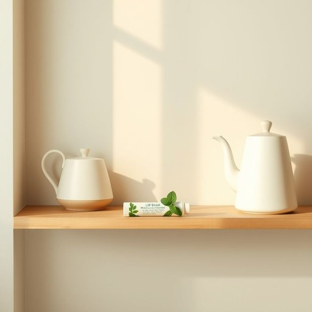

# lipbalm

<h1 style="font-size: 2.5em; font-weight: 300; letter-spacing: 2px; margin: 0; color: #2c3e50;">
/lipbalm*/
</h1>

---

---

## 例句

Before heading out this chilly morning, she grabbed the lipbalm from the cluttered shelf beside the kettle, knowing that its soothing, mint-infused formula would protect her lips from the biting cold and keep them hydrated throughout the day.

*Before(/ˌbiˈfɔr/) heading(/ˈhɛdɪŋ/) out(/aʊt/) this(/ðɪs/) chilly(/ˈʧɪli/) morning,(/ˈmɔrnɪŋ,/) she(/ʃi/) grabbed(/græbd/) the(/ðə/) lipbalm(/lipbalm*/) from(/frəm/) the(/ðə/) cluttered(/ˈklətərd/) shelf(/ʃɛlf/) beside(/ˌbiˈsaɪd/) the(/ðə/) kettle,(/ˈkɛtəl,/) knowing(/noʊɪŋ/) that(/ðət/) its(/ɪts/) soothing,(/ˈsuðɪŋ,/) mint-infused(/mint-infused*/) formula(/ˈfɔrmjələ/) would(/wʊd/) protect(/prəˈtɛkt/) her(/hər/) lips(/lɪps/) from(/frəm/) the(/ðə/) biting(/ˈbaɪtɪŋ/) cold(/koʊld/) and(/ənd/) keep(/kip/) them(/ðɛm/) hydrated(/ˈhaɪˌdreɪtəd/) throughout(/θruaʊt/) the(/ðə/) day.(/deɪ./)*

**翻译：** 在这个寒冷的清晨出门前，她从水壶旁杂乱的架子上拿起润唇膏，知道它那舒缓的薄荷配方能保护她的双唇免受刺骨寒风的侵袭，并全天保持润泽。

---

## 解释

英语单词lipbalm作为名词，主要指一种用于保护和滋润嘴唇的护肤品，常见于家居生活用品场景中，尤其在干燥、寒冷或风大的环境下使用，以防止嘴唇干裂或脱皮。在具体使用语境中，人们常在早晨起床后、外出前或感觉嘴唇干燥时涂抹lipbalm。英语学习者在使用该词时需注意其拼写为一个复合词，不用复数形式表示单纯的类型，但若谈论多种品牌或多支产品时可用复数形式lip balms。常见搭配包括apply lip balm（涂抹润唇膏）、chapped lips（干裂的嘴唇）和moisturizing lip balm（保湿润唇膏），表达时通常与动词apply、use连用，或形容词作定语修饰。词源上，lip指嘴唇，balm意为香膏、药膏，组合起来形象地指用于嘴唇的护肤膏，属于19世纪后期到20世纪早期随着个人护理产品丰富而逐渐普及的词汇。中文语境中lipbalm常译为润唇膏或唇膏，准确表达了其保护和滋润嘴唇的功能，语义中性，无明显褒贬或特殊文化色彩，但在年轻或美妆爱好者中使用较多，体现关爱自我护理的生活态度。

---

<small style="color: #999; font-size: 0.9em;">2025-07-17 06:22:40</small>

