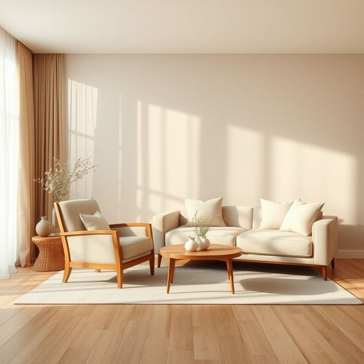

# living-area

<h1 style="font-size: 2.5em; font-weight: 300; letter-spacing: 2px; margin: 0; color: #2c3e50;">
/living-area*/
</h1>

---

---

## 例句

The paint we've chosen for the living-area, which is supposed to complement both the vintage armchair and the modern, minimalist sofa, will not only brighten the space but also create a cozy atmosphere perfect for relaxing after a long day's work.

*The(/ðə/) paint(/peɪnt/) we've(/wiv/) chosen(/ˈʧoʊzən/) for(/fər/) the(/ðə/) living-area,(/living-area*,/) which(/wɪʧ/) is(/ɪz/) supposed(/səˈpoʊzd/) to(/tɪ/) complement(/ˈkɑmpləmənt/) both(/boʊθ/) the(/ðə/) vintage(/ˈvɪntɪʤ/) armchair(/ˈɑrmˌʧɛr/) and(/ənd/) the(/ðə/) modern,(/ˈmɑdərn,/) minimalist(/ˈmɪnəməlɪst/) sofa,(/ˈsoʊfə,/) will(/wɪl/) not(/nɑt/) only(/ˈoʊnli/) brighten(/ˈbraɪtən/) the(/ðə/) space(/speɪs/) but(/bət/) also(/ˈɔlsoʊ/) create(/kriˈeɪt/) a(/ə/) cozy(/ˈkoʊzi/) atmosphere(/ˈætməsˌfɪr/) perfect(/ˈpərˌfɪkt/) for(/fər/) relaxing(/rɪˈlæksɪŋ/) after(/ˈæftər/) a(/ə/) long(/lɔŋ/) day's(/deɪz/) work.(/wərk./)*

**翻译：** 我们为客厅选用的油漆，不仅与复古扶手椅和现代极简沙发相得益彰，还能提亮空间，营造出一个温馨舒适的氛围，非常适合在忙碌一天后放松身心。

---

## 解释

“living-area”作为名词，通常指住宅内部供居住者日常生活、休息和娱乐的主要空间，常见于家居生活用品和室内装修的语境中，比如起居室、客厅等场所。使用时，英语学习者应注意它的复合名词结构，前半部分“living”作定语修饰“area”，整体指“生活区域”，通常用作单数形式，亦可根据具体情况复数化，比如“living areas”。常见搭配有“spacious living area”（宽敞的居住区）、“open-plan living area”（开放式居住空间）等，形容词多用于描述空间大小、布局或装饰风格。语法上，living-area通常作为名词使用，可在句中作主语、宾语或补语，但注意不可直接用作动词或形容词，同时拼写时有时会写作“living area”两个词，但在许多家居设计文本中视作固定搭配时也可连写。词源方面，“living”来源于古英语“libban”，意指“生活、居住”，与“life”同根，“area”源于拉丁语意为“空地、区域”，合起来即指“供生活使用的区域”，反映了现代住宅功能分区的需求。在中文环境中，准确译为“居住区”或“生活区”，强调的是室内专门用于生活起居的空间，区别于卧室、厨房等功能区，通常指客厅或类似的公共生活空间。该词无明显褒贬色彩，属于中性词汇，但在不同语境中可能暗含对舒适度和空间布局的评价，如“宽敞的living-area”往往带有积极的居住环境暗示。文化上，这一概念反映了现代家居强调开放、舒适和功能明确的生活方式，尤其在西方住宅设计中常被强调，而在中文语境中则更多与家庭聚会和亲子活动场所关联。

---

<small style="color: #999; font-size: 0.9em;">2025-07-17 06:22:40</small>

