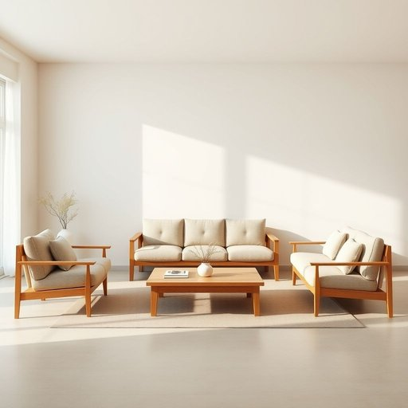

# living-room

<h1 style="font-size: 2.5em; font-weight: 300; letter-spacing: 2px; margin: 0; color: #2c3e50;">
/living-room*/
</h1>

---

---

## 例句

After the meeting, the furniture arrangement in the living-room became a topic of serious discussion among the team.

*After(/ˈæftər/) the(/ðə/) meeting,(/ˈmitɪŋ,/) the(/ðə/) furniture(/ˈfərnɪʧər/) arrangement(/ərˈeɪnʤmənt/) in(/ɪn/) the(/ðə/) living-room(/living-room*/) became(/bɪˈkeɪm/) a(/ə/) topic(/ˈtɑpɪk/) of(/əv/) serious(/ˈsɪriəs/) discussion(/dɪˈskəʃən/) among(/əˈməŋ/) the(/ðə/) team.(/tim./)*

**翻译：** 会议结束后，客厅的家具布置成为团队认真讨论的焦点。

---

## 解释

请按照以下格式要求格式化结果，只返回格式化后的内容，不要包含任何解释、思考过程或额外标记。请执行以下清理操作：1. 移除所有标签及其内容2. 移除所有标记3. 如果存在JSON格式要求，确保输出符合要求4. 移除的标记，保留内容5. 清理多余空白和换行6. 按照格式要求排版和格式化7. 不要添加任何解释或元信息8. 对于输入的重要信息，输出为一整个段落，不分段不使用Markdown符号不包含标题或额外信息。格式要求：格式要求简短描述：回答必须是一个连贯的中文段落，不分段不使用Markdown符号不包含标题或额外信息。格式示例：需要格式化的内容：“living-room”作为名词，指的是住宅中的客厅，是家庭成员用于休息、娱乐、接待访客的主要公共空间，适用于描述家居环境或家具布置场合。英语学习者使用时需注意该词为复合名词，通常作为单数出现且拼写时用连字符连接，复数形式为“living-rooms”；在表达搭配上，常见的有“living-room furniture”（客厅家具）、“living-room sofa”（客厅沙发）、“living-room carpet”（客厅地毯）等，形容词或动词可用来描述客厅的状态或布置，如“clean the living-room”（打扫客厅），“spacious living-room”（宽敞的客厅）。关于词源，“living-room”源于英文中的“living”表示“居住的”或“生活的”，“room”指“房间”，首次出现于19世纪末到20世纪初，强调居住空间中的生活活动场所，区别于卧室或厨房。中文语境中，“living-room”一般准确译为“客厅”，指家庭住宅中用于休闲和社交的房间，词义明确且无褒贬色彩，是日常家居生活的标准称谓，在文化上反映了西方住宅空间功能分区的习惯，与中文“客厅”在功能和使用上高度对应，无特殊隐喻或文化含义，因此学习和使用时应注重其作为住宅主要公共空间的定义及常见搭配。

---

<small style="color: #999; font-size: 0.9em;">2025-07-17 06:22:40</small>

