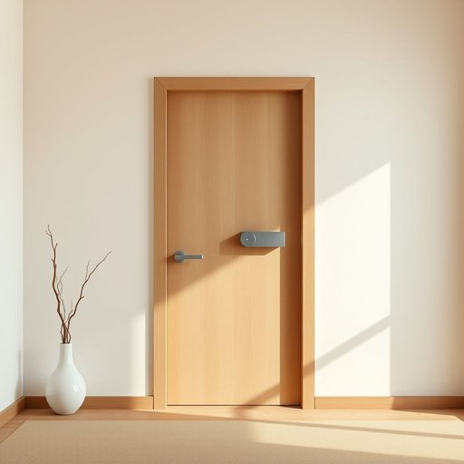

# lock

<h1 style="font-size: 2.5em; font-weight: 300; letter-spacing: 2px; margin: 0; color: #2c3e50;">
/lɑk/
</h1>

---

---

## 例句

Before leaving the house, she double-checked that the lock on the front door, which had been recently fitted with a state-of-the-art security system designed to withstand even the most determined burglars, was securely fastened to ensure the safety of her family and possessions.

*Before(/ˌbiˈfɔr/) leaving(/ˈlivɪŋ/) the(/ðə/) house,(/haʊs,/) she(/ʃi/) double-checked(/double-checked*/) that(/ðət/) the(/ðə/) lock(/lɑk/) on(/ɔn/) the(/ðə/) front(/frənt/) door,(/dɔr,/) which(/wɪʧ/) had(/hæd/) been(/bɪn/) recently(/ˈrisəntli/) fitted(/ˈfɪtɪd/) with(/wɪθ/) a(/ə/) state-of-the-art(/ˌsteɪtəvðɪˈɑrt/) security(/sɪˈkjʊrəti/) system(/ˈsɪstəm/) designed(/dɪˈzaɪnd/) to(/tɪ/) withstand(/wɪθˈstænd/) even(/ˈivɪn/) the(/ðə/) most(/moʊst/) determined(/dɪˈtərmənd/) burglars,(/ˈbərglərz,/) was(/wɑz/) securely(/sɪˈkjʊrli/) fastened(/ˈfæsənd/) to(/tɪ/) ensure(/ɪnˈʃʊr/) the(/ðə/) safety(/ˈseɪfti/) of(/əv/) her(/hər/) family(/ˈfæməli/) and(/ənd/) possessions.(/pəˈzɛʃənz./)*

**翻译：** 临出门前，她再次确认了前门锁是否牢牢锁好。这把门锁最近刚安装了最先进的安保系统，专为抵御最具决心的窃贼而设计，以保障她的家人和财物的安全。

---

## 解释

英语单词“lock”作为名词在家居生活用品的语境中，通常指用于门、抽屉、柜子等家具上的锁具，它是一种机械或电子装置，用来固定或保护某物不被未经授权者打开或进入。具体使用场合包括家门锁、抽屉锁、保险柜锁等，常见语境多涉及安全防护和隐私保护。英语学习者在使用“lock”作为名词时，需注意其单复数形式locks，以及常用搭配如“door lock”、“window lock”、“combination lock”、“key lock”等。此外，“lock”在表达时也常用于固定、上锁动作的相关短语和固定搭配，如“to put a lock on something”、“lock and key”等。词源方面，“lock”来源于古英语“locc”，意指环状或锁链状的固定装置，强调其固定与封闭的功能，这一词源反映了其机械固定的本质。中文语境中，“lock”精准翻译为“锁”，不仅指实体的锁，还有引申义如保护措施或保障手段，但在家居用品场景下主要指实物的机械装置。这个词一般无褒贬色彩，偏中性，但在文化层面，锁具往往象征安全和隐私保护，因此具有积极的安全意义。总的来说，“lock”作为名词在家居生活中是一个极为常见且功能明确的词汇，理解其固定、防护的本质和常见搭配，有助于学习者准确使用和理解该词。

---

<small style="color: #999; font-size: 0.9em;">2025-07-17 06:22:40</small>

