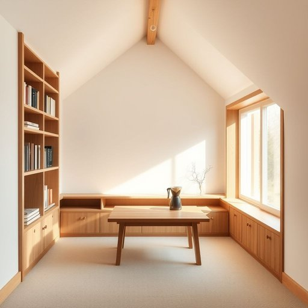

# loft

<h1 style="font-size: 2.5em; font-weight: 300; letter-spacing: 2px; margin: 0; color: #2c3e50;">
/lɔft/
</h1>

---

---

## 例句

After we clear out all the old boxes and unused furniture from the attic, I was thinking we could finally convert the loft into a cozy reading nook with built-in bookshelves, soft lighting, and perhaps even a small espresso machine to make the space both functional and inviting.

*After(/ˈæftər/) we(/wi/) clear(/klɪr/) out(/aʊt/) all(/ɔl/) the(/ðə/) old(/oʊld/) boxes(/ˈbɑksɪz/) and(/ənd/) unused(/ənˈjuzd/) furniture(/ˈfərnɪʧər/) from(/frəm/) the(/ðə/) attic,(/ˈætɪk,/) I(/aɪ/) was(/wɑz/) thinking(/ˈθɪŋkɪŋ/) we(/wi/) could(/kʊd/) finally(/ˈfaɪnəli/) convert(/ˈkɑnvərt/) the(/ðə/) loft(/lɔft/) into(/ˈɪntu/) a(/ə/) cozy(/ˈkoʊzi/) reading(/ˈrɛdɪŋ/) nook(/nʊk/) with(/wɪθ/) built-in(/ˈbɪlˌtɪn/) bookshelves,(/ˈbʊkˌʃɛlvz,/) soft(/sɔft/) lighting,(/ˈlaɪtɪŋ,/) and(/ənd/) perhaps(/pərˈhæps/) even(/ˈivɪn/) a(/ə/) small(/smɔl/) espresso(/ˌɛˈsprɛsoʊ/) machine(/məˈʃin/) to(/tɪ/) make(/meɪk/) the(/ðə/) space(/speɪs/) both(/boʊθ/) functional(/ˈfəŋkʃənəl/) and(/ənd/) inviting.(/ˌɪnˈvaɪtɪŋ./)*

**翻译：** 等我们清理掉阁楼里所有旧箱子和闲置家具后，我想我们终于可以把阁楼改造成一个温馨的阅读角，配上内置书架、柔和的灯光，甚至可能放上一台小型浓缩咖啡机，让这个空间既实用又舒适宜人。

---

## 解释

英语单词“loft”在家居生活用品语境中作为名词，通常指的是建筑物内部高处的一个开放式空间，常见于仓库改造的住宅或顶层阁楼，常被用作卧室、工作室或储藏室，具体使用场合多见于房屋结构描述或户型介绍，如“a loft apartment”（复式阁楼公寓）或“sleeping loft”（睡眠阁楼），英语学习者在使用“loft”时应注意其作为名词时多指空间或区域，常与表示位置的介词如“in”或“up”搭配，如“live in a loft”或“up in the loft”，此外，“loft”还可用作动词，意为把物体（如球）高高抛起，但在家居生活用品环境中主要指名词用法，在词源上，“loft”起源于古英语“lof(t)，”意为“棚、阁楼”，本义即为建筑上部的开放空间，后来用法逐渐扩大，中文语境中“loft”应准确译为“阁楼”或“顶楼开敞空间”，不同于传统意义上封闭的阁楼空间，更强调一种宽敞、开放且多功能的居住空间，文化内涵中“loft”常与现代、工业风住宅联系紧密，具有一定的时尚感和现代都市生活氛围，通常无褒贬色彩，但因普遍租金较高，也常被视为中高端住宅的象征，综合来看，“loft”一词在家居语境下是描述特定建筑空间的重要词汇，学习时应结合具体语境和搭配灵活运用。

---

<small style="color: #999; font-size: 0.9em;">2025-07-17 06:22:40</small>

