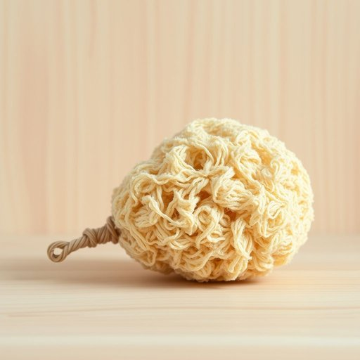

# loofah

<h1 style="font-size: 2.5em; font-weight: 300; letter-spacing: 2px; margin: 0; color: #2c3e50;">
/loofah*/
</h1>

---

---

## 例句

I always make sure to replace the loofah in the bathroom every few weeks because the loofah helps exfoliate dead skin more effectively than a regular sponge and prevents the buildup of bacteria that can cause unpleasant odors or skin irritations.

*I(/aɪ/) always(/ˈɔlˌweɪz/) make(/meɪk/) sure(/ʃʊr/) to(/tɪ/) replace(/ˌriˈpleɪs/) the(/ðə/) loofah(/loofah*/) in(/ɪn/) the(/ðə/) bathroom(/ˈbæθˌrum/) every(/ˈɛvəri/) few(/fju/) weeks(/wiks/) because(/bɪˈkəz/) the(/ðə/) loofah(/loofah*/) helps(/hɛlps/) exfoliate(/ɛksˈfoʊlieɪt/) dead(/dɛd/) skin(/skɪn/) more(/mɔr/) effectively(/ˈifɛktɪvli/) than(/ðən/) a(/ə/) regular(/ˈrɛgjələr/) sponge(/spənʤ/) and(/ənd/) prevents(/prɪˈvɛnts/) the(/ðə/) buildup(/ˈbɪlˌdəp/) of(/əv/) bacteria(/bækˈtɪriə/) that(/ðət/) can(/kən/) cause(/kɔz/) unpleasant(/ənˈplɛzənt/) odors(/ˈoʊdərz/) or(/ər/) skin(/skɪn/) irritations.(/ˌɪrɪˈteɪʃənz./)*

**翻译：** 我总是确保每隔几周更换浴室里的丝瓜络，因为丝瓜络比普通海绵更有效地帮助去除死皮，同时还能防止细菌滋生，避免产生难闻的气味或引发皮肤刺激。

---

## 解释

英语单词“loofah”在家居生活用品场景中作为名词，指的是一种天然的纤维海绵，通常由葫芦科植物成熟干燥后的果实制成，用于洗澡时擦洗皮肤，帮助去角质和清洁身体。具体使用场合多见于浴室用品描述，如“loofah sponge”（丝瓜络海绵）或“use a loofah to exfoliate”（用丝瓜络去角质）。英语学习者在使用“loofah”时需注意它通常作为可数名词使用，复数形式为“loofahs”，且多与动词“use”、形容词“natural”、“exfoliating”搭配，表达护肤或清洁功能时较为常见。词源上，“loofah”源自阿拉伯语“lushah”或埃及阿拉伯语，经过英语借用后专指这种天然植物海绵。中文语境中，“loofah”准确翻译为“丝瓜络”或“丝瓜海绵”，通常不用于指代一般的洗澡海绵，而明确指出是植物纤维制品。该词在家居用品领域没有明显的褒贬色彩，但因其天然环保的属性，常带有积极的健康、生态保养含义，无特殊的文化禁忌或讽刺意味。

---

<small style="color: #999; font-size: 0.9em;">2025-07-17 06:22:40</small>

