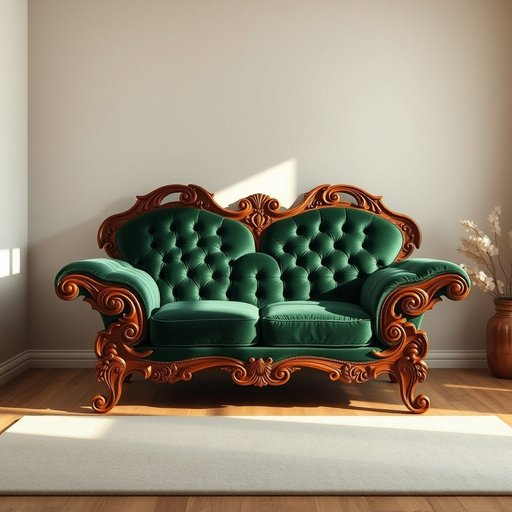

# loveseat

<h1 style="font-size: 2.5em; font-weight: 300; letter-spacing: 2px; margin: 0; color: #2c3e50;">
/loveseat*/
</h1>

---

---

## 例句

During the meeting, the architect emphasized that the unique loveseat, admired for its intricate wooden carvings and rich emerald velvet upholstery, would not only enhance the room’s aesthetic but also become a focal point encouraging guests to gather and engage in meaningful conversations.

*During(/ˈdʊrɪŋ/) the(/ðə/) meeting,(/ˈmitɪŋ,/) the(/ðə/) architect(/ˈɑrkəˌtɛkt/) emphasized(/ˈɛmfəˌsaɪzd/) that(/ðət/) the(/ðə/) unique(/juˈnik/) loveseat,(/loveseat*,/) admired(/ədˈmaɪərd/) for(/fər/) its(/ɪts/) intricate(/ˈɪntrəkət/) wooden(/ˈwʊdən/) carvings(/ˈkɑrvɪŋz/) and(/ənd/) rich(/rɪʧ/) emerald(/ˈɛmərrəld/) velvet(/ˈvɛlvət/) upholstery,(/əˈpoʊlstəri,/) would(/wʊd/) not(/nɑt/) only(/ˈoʊnli/) enhance(/ɛnˈhæns/) the(/ðə/) room’s(/room’s*/) aesthetic(/ɛsˈθɛtɪk/) but(/bət/) also(/ˈɔlsoʊ/) become(/bɪˈkəm/) a(/ə/) focal(/ˈfoʊkəl/) point(/pɔɪnt/) encouraging(/ɪnˈkərəʤɪŋ/) guests(/gɛsts/) to(/tɪ/) gather(/ˈgæðər/) and(/ənd/) engage(/ɪnˈgeɪʤ/) in(/ɪn/) meaningful(/ˈminɪŋfəl/) conversations.(/ˌkɑnvərˈseɪʃənz./)*

**翻译：** 会议中，建筑师强调，这款独特的双人沙发以其精致的木雕和浓郁的翡翠绿天鹅绒装饰广受赞赏，不仅能提升房间的美感，还将成为吸引宾客聚集、展开深入交谈的焦点。

---

## 解释

“loveseat”作为家居生活用品领域的名词，指的是一种设计较小、通常可容纳两人的沙发或座椅，主要用于紧凑空间，如客厅、卧室或小型休息区，因其尺寸适中，特别适合情侣或密切关系的人一同坐着。英语学习者在使用“loveseat”时应注意它一般作为可数名词，常用单数和复数形式（loveseats），通常搭配的形容词有“comfortable”（舒适的）、“plush”（豪华的）、“modern”（现代的），表达时多用“a loveseat”或“the loveseat”，且常见用法包括“sit on the loveseat”或“buy a loveseat”。其词源可以追溯到18世纪末至19世纪初的英语，最初指的是专为情侣设计、小巧且能让两人亲密坐在一起的座椅，体现了亲密和浪漫的文化内涵，名称中的“love”明确暗示了其适合恋人共用的设计概念。在中文语境中，“loveseat”准确翻译为“双人沙发”或“情侣沙发”，强调的是其二人座位和亲密无间的特点，常见于家具商店或家居装饰描述中。此词没有明显褒贬色彩，但由于其文化背景，带有一定的温馨、浪漫的意味，适用于表达家居环境中人际亲密关系的场合。

---

<small style="color: #999; font-size: 0.9em;">2025-07-17 06:22:40</small>

