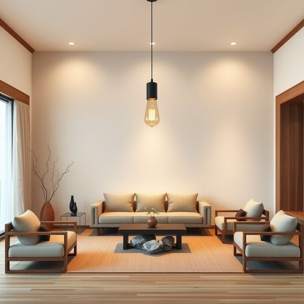

# luminaire

<h1 style="font-size: 2.5em; font-weight: 300; letter-spacing: 2px; margin: 0; color: #2c3e50;">
/luminaire*/
</h1>

---

---

## 例句

Replacing the outdated luminaire in the living room, which has been flickering intermittently and casting uneven shadows, with a modern, energy-efficient LED fixture that offers adjustable brightness and colour temperature, could really enhance the ambience and make the space more inviting during both day and night.

*Replacing(/rɪˈpleɪsɪŋ/) the(/ðə/) outdated(/ˈaʊtˌdeɪtɪd/) luminaire(/luminaire*/) in(/ɪn/) the(/ðə/) living(/ˈlɪvɪŋ/) room,(/rum,/) which(/wɪʧ/) has(/həz/) been(/bɪn/) flickering(/ˈflɪkərɪŋ/) intermittently(/ˌɪntərˈmɪtəntli/) and(/ənd/) casting(/ˈkæstɪŋ/) uneven(/əˈnivən/) shadows,(/ˈʃæˌdoʊz,/) with(/wɪθ/) a(/ə/) modern,(/ˈmɑdərn,/) energy-efficient(/energy-efficient*/) LED(/lɛd/) fixture(/ˈfɪksʧər/) that(/ðət/) offers(/ˈɔfərz/) adjustable(/əˈʤəstəbəl/) brightness(/ˈbraɪtnəs/) and(/ənd/) colour(/ˈkələr/) temperature,(/ˈtɛmpərəʧər,/) could(/kʊd/) really(/ˈrɪli/) enhance(/ɛnˈhæns/) the(/ðə/) ambience(/ˈæmbiəns/) and(/ənd/) make(/meɪk/) the(/ðə/) space(/speɪs/) more(/mɔr/) inviting(/ˌɪnˈvaɪtɪŋ/) during(/ˈdʊrɪŋ/) both(/boʊθ/) day(/deɪ/) and(/ənd/) night.(/naɪt./)*

**翻译：** 将客厅中那盏时有闪烁且投射出不均匀阴影的陈旧灯具替换为一款现代节能的LED灯具，该灯具具备可调节亮度和色温的功能，能够显著提升空间氛围，使室内在白天和夜晚都更加温馨宜人。

---

## 解释

英语单词“luminaire”在家居生活用品场景中作为名词，主要指的是带有固定灯具的整体照明设备，通常包括灯泡、灯罩及其安装配件，广泛应用于室内外照明，如吊灯、壁灯、吸顶灯等。该词多用于较为正式或专业的语境，如家居装修、建筑设计、照明工程等领域。英语学习者使用时需注意，“luminaire”作为可数名词，复数形式为“luminaires”，搭配常见表达有“ceiling luminaire”（吸顶灯）、“outdoor luminaire”（户外灯具）等，句中通常作主语或宾语出现，且多用于书面或技术性描述，不用于口语日常对话中。词源方面，“luminaire”源自法语，进而来自拉丁语“lumen”，意指“光”或“灯光”，体现其与光源的紧密关系。中文语境中，“luminaire”准确翻译为“灯具”或“灯饰”，指的是具备完整结构和安装形态的照明装置，而非单纯的灯泡或光源；在家居生活中也常被理解为具有装饰效果的照明设备。该词本身无明显褒贬色彩，属于中性词汇，使用时更多强调其功能性与设计性，有时带有一定的专业或高端照明设备的意味。整体而言，掌握“luminaire”的使用有助于理解和表达有关现代家居照明设计和设备的细节和专业内容。

---

<small style="color: #999; font-size: 0.9em;">2025-07-17 06:22:40</small>

