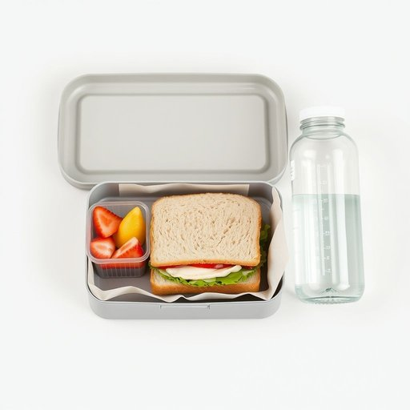

# lunchbox

<h1 style="font-size: 2.5em; font-weight: 300; letter-spacing: 2px; margin: 0; color: #2c3e50;">
/lunchbox*/
</h1>

---

---

## 例句

Before heading out for school, Emily carefully packed her lunchbox with a homemade sandwich, a small container of fresh fruit, and a bottle of water, making sure everything was securely sealed to avoid any spills in her school bag.

*Before(/ˌbiˈfɔr/) heading(/ˈhɛdɪŋ/) out(/aʊt/) for(/fər/) school,(/skul,/) Emily(/ˈɛmɪli/) carefully(/ˈkɛrfəli/) packed(/pækt/) her(/hər/) lunchbox(/lunchbox*/) with(/wɪθ/) a(/ə/) homemade(/ˈhoʊˈmeɪd/) sandwich,(/ˈsænwɪʧ,/) a(/ə/) small(/smɔl/) container(/kənˈteɪnər/) of(/əv/) fresh(/frɛʃ/) fruit,(/frut,/) and(/ənd/) a(/ə/) bottle(/ˈbɑtəl/) of(/əv/) water,(/ˈwɔtər,/) making(/ˈmeɪkɪŋ/) sure(/ʃʊr/) everything(/ˈɛvriˌθɪŋ/) was(/wɑz/) securely(/sɪˈkjʊrli/) sealed(/sild/) to(/tɪ/) avoid(/əˈvɔɪd/) any(/ˈɛni/) spills(/spɪlz/) in(/ɪn/) her(/hər/) school(/skul/) bag.(/bæg./)*

**翻译：** 出门去学校前，艾米丽细心地将自制的三明治、新鲜水果的小容器和一瓶水装进午餐盒，确保所有东西都密封牢固，以免在书包里洒漏。

---

## 解释

“lunchbox”作为名词，指的是家居生活中用来装午餐的便携式盒子，通常由塑料或金属制成，方便人们在外出时携带饭菜，尤其在学校、工作场所或野餐等场合广泛使用。英语中，使用“lunchbox”时需注意它通常作可数名词，前面常搭配冠词如“a lunchbox”或者数量词，如“two lunchboxes”，且常见的表达有“packed lunchbox”（装好饭的饭盒）、“metal/plastic lunchbox”等。语法上，作为具体物品名词，“lunchbox”可以作主语、宾语或介词宾语，如“He forgot his lunchbox”或“Put the sandwich in the lunchbox”。词源上，“lunchbox”由“lunch”（午餐）和“box”（盒子）合成，最早出现于19世纪末期，反映了随着工业化和城市生活节奏加快，人们携带午餐需求的增长。在中文语境中，多准确翻译为“饭盒”或“午餐盒”，含义明确无歧义，不带褒贬色彩，但在文化层面上，“lunchbox”还可能象征家庭关怀和日常生活的温馨，因为自带饭盒通常意味着亲手准备的食物，传递出关爱和健康的含义。总之，“lunchbox”在家居生活用品中是一个实用且常见的名词，学习时应注意其具体指代、常用搭配及合适语法使用。

---

<small style="color: #999; font-size: 0.9em;">2025-07-17 06:22:40</small>

