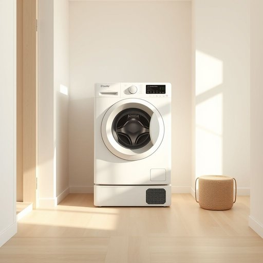

# machine

<h1 style="font-size: 2.5em; font-weight: 300; letter-spacing: 2px; margin: 0; color: #2c3e50;">
/məˈʃin/
</h1>

---

---

## 例句

I was hoping you could help me figure out why the washing machine, which usually handles our laundry without a hitch, suddenly stopped spinning halfway through the cycle, especially since I just had it serviced last month and followed every instruction in the manual precisely.

*I(/aɪ/) was(/wɑz/) hoping(/ˈhoʊpɪŋ/) you(/ju/) could(/kʊd/) help(/hɛlp/) me(/mi/) figure(/ˈfɪgjər/) out(/aʊt/) why(/waɪ/) the(/ðə/) washing(/ˈwɑʃɪŋ/) machine,(/məˈʃin,/) which(/wɪʧ/) usually(/ˈjuʒəwəli/) handles(/ˈhændəlz/) our(/ɑr/) laundry(/ˈlɔndri/) without(/wɪˈθaʊt/) a(/ə/) hitch,(/hɪʧ,/) suddenly(/ˈsədənli/) stopped(/stɑpt/) spinning(/ˈspɪnɪŋ/) halfway(/ˈhæfˈweɪ/) through(/θru/) the(/ðə/) cycle,(/ˈsaɪkəl,/) especially(/əˈspɛʃəli/) since(/sɪns/) I(/aɪ/) just(/ʤɪst/) had(/hæd/) it(/ɪt/) serviced(/ˈsərvɪst/) last(/læst/) month(/mənθ/) and(/ənd/) followed(/ˈfɑloʊd/) every(/ˈɛvəri/) instruction(/ˌɪnˈstrəkʃən/) in(/ɪn/) the(/ðə/) manual(/ˈmænjuəl/) precisely.(/prɪˈsaɪsli./)*

**翻译：** 我本希望您能帮我弄清楚，平时洗衣服从没出过问题的洗衣机，为什么突然在洗涤程序进行到一半时停止了转动，尤其是考虑到我上个月刚刚对它进行了维护，并且严格按照说明书的每一步操作。

---

## 解释

英语单词“machine”作为名词在家居生活用品场景中，通常指的是能够通过机械或电子装置完成特定任务的设备，如洗衣机、咖啡机、洗碗机等，这类“machine”在日常生活中帮助减轻劳动强度，提高效率。学习者在使用“machine”时需注意其单数和复数形式“machines”，以及与其搭配的常用表达如“operate a machine”（操作机器）、“a household machine”（家用机器）等，此外，常见的固定搭配还有“vending machine”（自动售货机）和“coffee machine”等，表达时应注意根据具体功能选择合适的形容词或名词修饰词。词源方面，“machine”源自拉丁语“machina”，原指用于作战的工程装置，后来引申为任何由多个部件组合起来完成工作的机械装置，这一演变反映了技术从简单工具到复杂设备的转变。在中文语境中，“machine”准确对应的翻译为“机器”、“机械”或“机”，强调其机械或电子装置的属性，没有明显褒贬色彩，更多体现实用性和效率，但在特定语境中，也可能因机械化带来的冷漠感或替代人工的负面影响而带有微弱负面含义。总体而言，“machine”在家居生活中是一个中性词，指代各种自动化或半自动化的生活辅助设备，使用时需结合具体物品和功能理解和表达。

---

<small style="color: #999; font-size: 0.9em;">2025-07-17 06:22:40</small>

