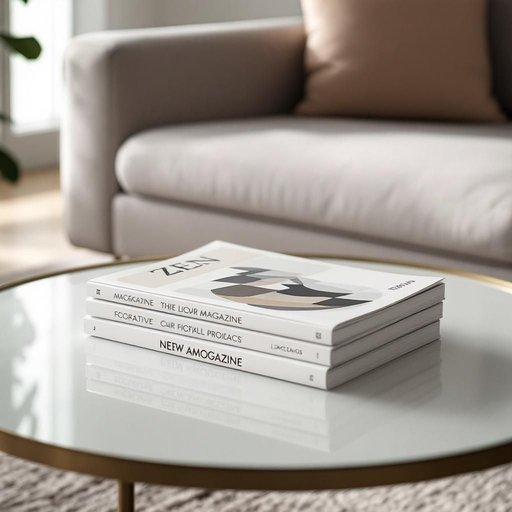

# magazine

<h1 style="font-size: 2.5em; font-weight: 300; letter-spacing: 2px; margin: 0; color: #2c3e50;">
/ˈmægəˌzin/
</h1>

---

---

## 例句

The stack of magazines on the coffee table, which showcases the latest interior design trends on its glossy cover, offers a wealth of inspiration for redecorating the living room this weekend.

*The(/ðə/) stack(/stæk/) of(/əv/) magazines(/ˈmægəˌzinz/) on(/ɔn/) the(/ðə/) coffee(/ˈkɔfi/) table,(/ˈteɪbəl,/) which(/wɪʧ/) showcases(/ˈʃoʊˌkeɪsɪz/) the(/ðə/) latest(/ˈleɪtəst/) interior(/ˌɪnˈtɪriər/) design(/dɪˈzaɪn/) trends(/trɛnz/) on(/ɔn/) its(/ɪts/) glossy(/ˈglɔsi/) cover,(/ˈkəvər,/) offers(/ˈɔfərz/) a(/ə/) wealth(/wɛlθ/) of(/əv/) inspiration(/ˌɪnspərˈeɪʃən/) for(/fər/) redecorating(/riˈdɛkərˌeɪtɪŋ/) the(/ðə/) living(/ˈlɪvɪŋ/) room(/rum/) this(/ðɪs/) weekend.(/ˈwiˌkɪnd./)*

**翻译：** 茶几上的那摞杂志，封面光鲜亮丽地展示了最新的室内设计趋势，为本周末重新布置客厅提供了丰富的灵感。

---

## 解释

英语单词“magazine”作为名词，在家居生活用品的语境中通常指的是供人阅读的“杂志”，即定期出版的印刷或电子刊物，内容涵盖生活、时尚、健康、娱乐等多方面，常见于家庭客厅、书房或卧室等环境。具体使用场合多为描述家中陈列、阅读材料或休闲娱乐，如“a stack of magazines on the coffee table”（茶几上的一堆杂志）。英语学习者在使用该词时需注意其不可数和可数用法的区别，通常指具体一本或多本杂志时为可数，泛指杂志作为一种媒介时可作不可数使用，常见搭配有“read a magazine”（读杂志）、“subscribe to a magazine”（订阅杂志）、“magazine rack”（杂志架）等。此外，“magazine”在军事语境中还可指“弹夹”或“弹仓”，但在家居生活用品领域一般不涉及该义。该词源于阿拉伯语“makhzan”，意为存储处，后来通过法语传入英语，本义为储存物品的地方，逐渐引申为存放印刷品的“杂志”。在中文语境中，“magazine”准确翻译为“杂志”，强调的是定期出版的印刷或电子刊物，通常无褒贬色彩，属于中性词汇，代表一种文化消费品或娱乐阅读材料，反映家庭生活中的一种休闲文化元素。

---

<small style="color: #999; font-size: 0.9em;">2025-07-17 06:22:40</small>

