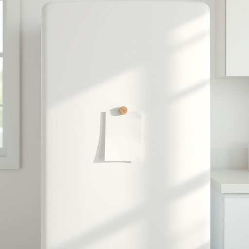

# magnet

<h1 style="font-size: 2.5em; font-weight: 300; letter-spacing: 2px; margin: 0; color: #2c3e50;">
/ˈmægnət/
</h1>

---

---

## 例句

Could you please check if the small magnet holding the shopping list on the fridge door, which has already lost some of its strength due to constant use and exposure to moisture, needs replacing before we head out later?

*Could(/kʊd/) you(/ju/) please(/pliz/) check(/ʧɛk/) if(/ɪf/) the(/ðə/) small(/smɔl/) magnet(/ˈmægnət/) holding(/ˈhoʊldɪŋ/) the(/ðə/) shopping(/ˈʃɑpɪŋ/) list(/lɪst/) on(/ɔn/) the(/ðə/) fridge(/frɪʤ/) door,(/dɔr,/) which(/wɪʧ/) has(/həz/) already(/ɔˈrɛdi/) lost(/lɔst/) some(/səm/) of(/əv/) its(/ɪts/) strength(/strɛŋθ/) due(/du/) to(/tɪ/) constant(/ˈkɑnstənt/) use(/juz/) and(/ənd/) exposure(/ɪkˈspoʊʒər/) to(/tɪ/) moisture,(/ˈmɔɪsʧər,/) needs(/nidz/) replacing(/rɪˈpleɪsɪŋ/) before(/ˌbiˈfɔr/) we(/wi/) head(/hɛd/) out(/aʊt/) later?(/ˈleɪtər?/)*

**翻译：** 请你帮忙检查一下冰箱门上那个用来固定购物清单的小磁铁，因为经常使用且受潮，磁力已经有所减弱，看看我们待会儿出门前是否需要更换？

---

## 解释

“magnet”作为名词在家居生活用品场景中通常指“磁铁”，是一种能够产生磁场并吸引铁、镍、钴等金属物体的小工具，常见于冰箱门吸附装饰品、固定便签或作为柜门的闭合装置。例如，人们会说“Put a magnet on the fridge to hold notes”（把磁铁贴在冰箱上用来夹便条）。英语学习者在使用“magnet”时应注意其基本语法为可数名词，常见搭配包括“fridge magnet”（冰箱贴）、“magnetic field”（磁场）、“magnet strip”（磁条）、“magnets on the door”（门上的磁铁）等，这些短语体现了其具体用途和功能。此外，“magnet”也可用于比喻表达，如“a magnet for tourists”（吸引游客的人或物），但这在家居用品语境中较少见。词源上，“magnet”源自古希腊地名“Magnēs lapis”，指的是最早被发现并利用的磁石矿，经历拉丁语“magnetem”传入英语，有着悠久的科学和文化背景。在中文语境中，“magnet”应准确翻译为“磁铁”而非泛泛的“磁石”，以明确其人为制成并应用于家居日常的功能性质。这个词语本身无褒贬含义，通常带有实用和科技感，是家居生活中常见且功能明确的物品名称。

---

<small style="color: #999; font-size: 0.9em;">2025-07-17 06:22:40</small>

