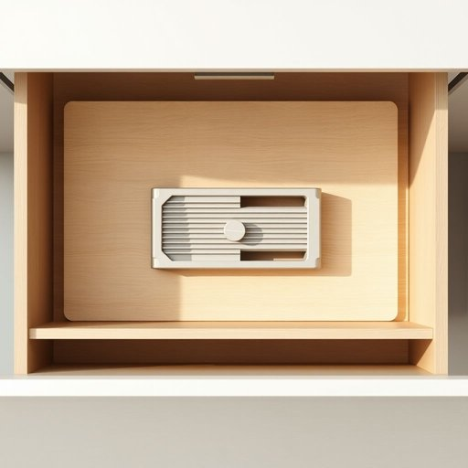

# mandoline

<h1 style="font-size: 2.5em; font-weight: 300; letter-spacing: 2px; margin: 0; color: #2c3e50;">
/mandoline*/
</h1>

---

---

## 例句

Before we start preparing the ratatouille, could you please pass me the mandoline from the drawer, the one with the adjustable blade that Julian recommended for slicing vegetables uniformly and quickly, so that our dish looks as professional as the ones in that French cookbook we bought last month?

*Before(/ˌbiˈfɔr/) we(/wi/) start(/stɑrt/) preparing(/pərˈpɛrɪŋ/) the(/ðə/) ratatouille,(/ˌrætəˈtuj,/) could(/kʊd/) you(/ju/) please(/pliz/) pass(/pæs/) me(/mi/) the(/ðə/) mandoline(/mandoline*/) from(/frəm/) the(/ðə/) drawer,(/drɔr,/) the(/ðə/) one(/wən/) with(/wɪθ/) the(/ðə/) adjustable(/əˈʤəstəbəl/) blade(/bleɪd/) that(/ðət/) Julian(/ˈʤuljən/) recommended(/ˌrɛkəˈmɛndɪd/) for(/fər/) slicing(/sˈlaɪsɪŋ/) vegetables(/ˈvɛʤtəbəlz/) uniformly(/ˈjunəˌfɔrmli/) and(/ənd/) quickly,(/kˈwɪkli,/) so(/soʊ/) that(/ðət/) our(/ɑr/) dish(/dɪʃ/) looks(/lʊks/) as(/ɛz/) professional(/prəˈfɛʃənəl/) as(/ɛz/) the(/ðə/) ones(/wənz/) in(/ɪn/) that(/ðət/) French(/frɛnʧ/) cookbook(/ˈkʊkˌbʊk/) we(/wi/) bought(/bɔt/) last(/læst/) month?(/mənθ?/)*

**翻译：** 在我们开始准备普罗旺斯杂烩菜之前，能否请你帮我从抽屉里拿一下那把贾利安推荐的可调节刀刃刨丝器，用来快速均匀地切蔬菜，这样我们的菜肴看起来才能像上个月买的那本法国食谱里的成品一样专业。

---

## 解释

“mandoline”作为家居生活用品中的名词，指的是一种厨房用具，主要用于切片蔬菜、水果或其他食材，能够快速且均匀地切出薄片，常见于制作沙拉、配菜或准备食材的场合。在英语语境下，这个词多出现在烹饪或厨房用具相关的对话、文章和食谱中。学习者需要注意的是，“mandoline”作为单数名词使用，与之相关的词汇常见搭配有“mandoline slicer”（切片机）、“use a mandoline to slice”（用切片器切片）、“adjust the mandoline thickness”（调整曼陀林切片厚度）等，通常后面会跟上介词短语或描述用途的动词。语法上，“mandoline”作为具体物品名词，遵循一般可数名词的使用规则，可以加冠词（a mandoline）或复数（mandolines），但在日常口语里多指特指的单个工具。词源上，“mandoline”源自法语mandoline，这个词与意大利的同形多指一种弦乐器曼陀林（mandolin）不同，作为厨房器具的mandoline是19世纪由法国厨师发明的切片器，因此其词源带有法语烹饪文化背景。中文中，“mandoline”常准确译为“切片器”或“曼陀林切片器”，不宜直接音译为“曼陀林”以免混淆为乐器。它没有褒贬色彩，是中性专业词汇，代表一种实用的厨房工具，体现了现代家居生活中对食材处理效率的追求。

---

<small style="color: #999; font-size: 0.9em;">2025-07-17 06:22:40</small>

