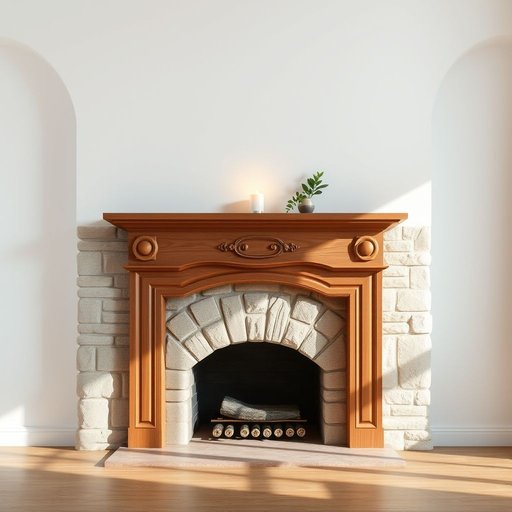

# mantel

<h1 style="font-size: 2.5em; font-weight: 300; letter-spacing: 2px; margin: 0; color: #2c3e50;">
/ˈmæntəl/
</h1>

---

---

## 例句

After carefully dusting the intricate carvings on the wooden mantel, which gracefully frames the old stone fireplace in the living room, she arranged a collection of vintage photographs and scented candles on top, creating a cozy and inviting atmosphere that perfectly complemented the soft glow of the evening fire.

*After(/ˈæftər/) carefully(/ˈkɛrfəli/) dusting(/ˈdəstɪŋ/) the(/ðə/) intricate(/ˈɪntrəkət/) carvings(/ˈkɑrvɪŋz/) on(/ɔn/) the(/ðə/) wooden(/ˈwʊdən/) mantel,(/ˈmæntəl,/) which(/wɪʧ/) gracefully(/ˈgreɪsfəli/) frames(/freɪmz/) the(/ðə/) old(/oʊld/) stone(/stoʊn/) fireplace(/ˈfaɪərˌpleɪs/) in(/ɪn/) the(/ðə/) living(/ˈlɪvɪŋ/) room,(/rum,/) she(/ʃi/) arranged(/əreɪnʤd/) a(/ə/) collection(/kəˈlɛkʃən/) of(/əv/) vintage(/ˈvɪntɪʤ/) photographs(/ˈfoʊtəˌgræfs/) and(/ənd/) scented(/ˈsɛntɪd/) candles(/ˈkændəlz/) on(/ɔn/) top,(/tɔp,/) creating(/kriˈeɪtɪŋ/) a(/ə/) cozy(/ˈkoʊzi/) and(/ənd/) inviting(/ˌɪnˈvaɪtɪŋ/) atmosphere(/ˈætməsˌfɪr/) that(/ðət/) perfectly(/ˈpərfəktli/) complemented(/ˈkɑmpləˌmɛntɪd/) the(/ðə/) soft(/sɔft/) glow(/gloʊ/) of(/əv/) the(/ðə/) evening(/ˈivnɪŋ/) fire.(/faɪər./)*

**翻译：** 她细心地擦拭着客厅里那座古老石壁炉上方优雅环绕的木制壁炉架上的精致雕刻，然后在上面摆放了一组复古照片和香薰蜡烛，营造出温馨宜人的氛围，与夜晚壁炉柔和的火光完美融合。

---

## 解释

英语单词“mantel”在家居生活用品的语境中作为名词，指的是壁炉架或壁炉的装饰性顶梁，通常位于壁炉开口的上方，用于放置装饰品如照片、烛台或花瓶。具体使用场合多见于描写室内装潢、传统家庭氛围或影视作品中的家居环境。学习者在使用“mantel”时应注意拼写区别于近音词“mantle”（意为斗篷或覆盖物），二者含义和用法不同；并且在语法上，“mantel”通常是可数名词，如a mantel或the mantel，而不用复数形式描述单一壁炉架。常见搭配包括“mantel shelf”（壁炉架的板面）、“mantel clock”（放置在壁炉架上的钟）等。该词源自中古英语“mantel”，源自中古法语“mantel”，意为披风或覆盖物，后引申为覆盖壁炉的结构部分。中文语境中准确翻译为“壁炉架”或“壁炉台”，是家居装饰中展示美观和实用性的固定家具部件，无特殊褒贬或文化色彩，但因其传统性较强，现代家居中未必普遍存在。

---

<small style="color: #999; font-size: 0.9em;">2025-07-17 06:22:40</small>

