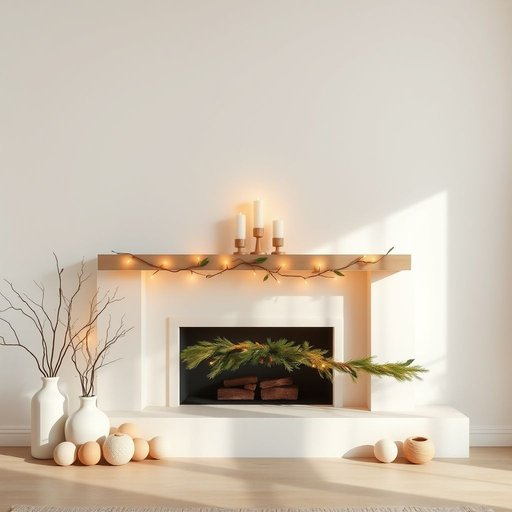

# mantelpiece

<h1 style="font-size: 2.5em; font-weight: 300; letter-spacing: 2px; margin: 0; color: #2c3e50;">
/mantelpiece*/
</h1>

---

---

## 例句

Every winter, the mantelpiece becomes a focal point of festive celebration, its ornaments—ranging from hand-painted candles to delicate fairy lights and a garland of holly—transforming the living room into a warm and inviting space that embodies a cherished family tradition passed down through generations.

*Every(/ˈɛvəri/) winter,(/ˈwɪntər,/) the(/ðə/) mantelpiece(/mantelpiece*/) becomes(/bɪˈkəmz/) a(/ə/) focal(/ˈfoʊkəl/) point(/pɔɪnt/) of(/əv/) festive(/ˈfɛstɪv/) celebration,(/ˌsɛləˈbreɪʃən,/) its(/ɪts/) ornaments—ranging(/ornaments—ranging*/) from(/frəm/) hand-painted(/hand-painted*/) candles(/ˈkændəlz/) to(/tɪ/) delicate(/ˈdɛləkət/) fairy(/ˈfɛri/) lights(/laɪts/) and(/ənd/) a(/ə/) garland(/ˈgɑrlənd/) of(/əv/) holly—transforming(/holly—transforming*/) the(/ðə/) living(/ˈlɪvɪŋ/) room(/rum/) into(/ˈɪntu/) a(/ə/) warm(/wɔrm/) and(/ənd/) inviting(/ˌɪnˈvaɪtɪŋ/) space(/speɪs/) that(/ðət/) embodies(/ɛmˈbɑdiz/) a(/ə/) cherished(/ˈʧɛrɪʃt/) family(/ˈfæməli/) tradition(/trəˈdɪʃən/) passed(/pæst/) down(/daʊn/) through(/θru/) generations.(/ˌʤɛnərˈeɪʃənz./)*

**翻译：** 每到冬季，壁炉架便成为节日庆典的焦点，装饰品从手绘蜡烛到精致的仙女灯，再到一串冬青花环，将客厅点缀得温馨宜人，承载着代代相传的珍贵家庭传统。

---

## 解释

mantelpiece作为名词，指的是壁炉上方凸出的装饰性架子或台面，通常用于摆放装饰物如相框、钟表、烛台等，常见于传统或经典风格的居室中。在家居生活用品中，mantelpiece主要出现在描述客厅、书房或有壁炉的房间布置时，强调其作为展示小件物品或装饰焦点的功能。英语学习者使用该词时需注意其为单数名词，复数形式为mantelpieces，通常与介词on（比如on the mantelpiece）搭配使用，描述位置关系常见搭配有decorate the mantelpiece（装饰壁炉架），或者an ornament on the mantelpiece（壁炉架上的装饰物）。语法上，mantelpiece一般作为可数名词出现，且多用于具体指物，在句中可作主语、宾语或介词宾语。词源方面，mantelpiece由两个部分组成：mantel源自中世纪拉丁语mantellum，意为披肩或覆盖物，后来引申为壁炉周围的装饰结构；piece意指部分或件，组合起来即指壁炉上的构件或架子。在中文语境中，mantelpiece准确翻译为壁炉架或壁炉台，强调其在壁炉正上方的架面功能，区别于壁炉（fireplace）本身。该词没有褒贬色彩，但因其多与传统、温馨、典雅的居家氛围相关联，具有一定的文化审美内涵，常被用来突出居室的经典或历史感。

---

<small style="color: #999; font-size: 0.9em;">2025-07-17 06:22:40</small>

