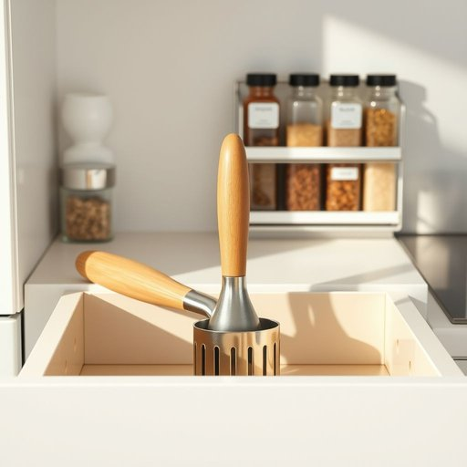

# masher

<h1 style="font-size: 2.5em; font-weight: 300; letter-spacing: 2px; margin: 0; color: #2c3e50;">
/masher*/
</h1>

---

---

## 例句

Could you please hand me the potato masher that’s tucked away in the third drawer next to the spice rack, the one with the wooden handle and stainless steel head, because I want to make sure the mashed potatoes have the perfect, creamy texture without any lumps before we start plating the dinner?

*Could(/kʊd/) you(/ju/) please(/pliz/) hand(/hænd/) me(/mi/) the(/ðə/) potato(/pəˈteɪˌtoʊ/) masher(/masher*/) that’s(/that’s*/) tucked(/təkt/) away(/əˈweɪ/) in(/ɪn/) the(/ðə/) third(/θərd/) drawer(/drɔr/) next(/nɛkst/) to(/tɪ/) the(/ðə/) spice(/spaɪs/) rack,(/ræk,/) the(/ðə/) one(/wən/) with(/wɪθ/) the(/ðə/) wooden(/ˈwʊdən/) handle(/ˈhændəl/) and(/ənd/) stainless(/ˈsteɪnləs/) steel(/stil/) head,(/hɛd,/) because(/bɪˈkəz/) I(/aɪ/) want(/wɔnt/) to(/tɪ/) make(/meɪk/) sure(/ʃʊr/) the(/ðə/) mashed(/mæʃt/) potatoes(/pəˈteɪtoʊz/) have(/hæv/) the(/ðə/) perfect,(/ˈpərˌfɪkt,/) creamy(/ˈkrimi/) texture(/ˈtɛksʧər/) without(/wɪˈθaʊt/) any(/ˈɛni/) lumps(/ləmps/) before(/ˌbiˈfɔr/) we(/wi/) start(/stɑrt/) plating(/ˈpleɪtɪŋ/) the(/ðə/) dinner?(/ˈdɪnər?/)*

**翻译：** 你能帮我拿一下放在调料架旁第三个抽屉里那个带木柄和不锈钢头的土豆压泥器吗？我想确保土豆泥的质地完美细腻，没有一丝疙瘩，方便我们开始装盘晚餐。

---

## 解释

“masher”作为名词在家居生活用品的英语语境中，通常指用于压碎或碾碎食材的工具，尤其是土豆压泥器。这种工具常见于厨房，用户在制作土豆泥、南瓜泥等菜肴时使用，具有压碎食材使其细腻柔软的功能。英语学习者在使用“masher”时应注意，单数形式为“masher”，复数则为“mashers”，通常与具体食材名称连用，如“potato masher”（土豆压泥器）、“fruit masher”（水果压泥器），表达时常见搭配还有“use a masher to crush”或“mash vegetables with a masher”，这些词组清晰描述工具和使用动作。词源上，“masher”源自动词“mash”，意为压碎、捣烂，后加后缀“-er”构成表工具或施事者的名词，体现其功能性特征。在中文语境中，“masher”准确翻译为“压泥器”或“捣泥器”，强调其厨房工具属性，无褒贬含义，仅指实用器具。从文化角度看，“masher”作为厨房用具广泛存在于西方家庭中，符合日常烹饪的基本需求，无特殊文化负载或隐含意义，因此学习者应重点掌握其具体用途和相关搭配，避免将其与其他含义混淆。

---

<small style="color: #999; font-size: 0.9em;">2025-07-17 06:22:40</small>

