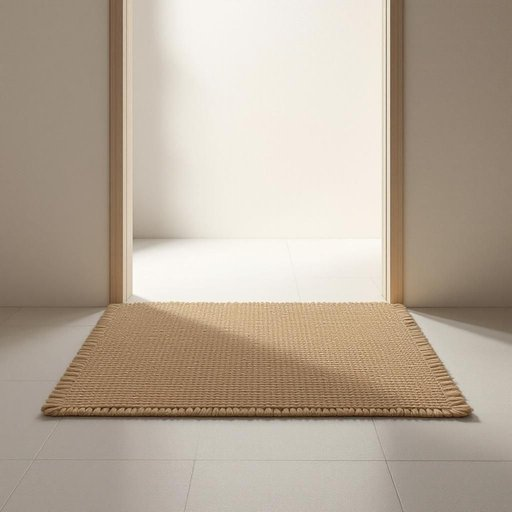

# mat

<h1 style="font-size: 2.5em; font-weight: 300; letter-spacing: 2px; margin: 0; color: #2c3e50;">
/mæt/
</h1>

---

---

## 例句

Before entering the living room, please wipe your feet thoroughly on the thick, woven mat by the door, which not only helps keep the floor clean but also adds a cosy touch to the hallway’s understated decor.

*Before(/ˌbiˈfɔr/) entering(/ˈɛnərɪŋ/) the(/ðə/) living(/ˈlɪvɪŋ/) room,(/rum,/) please(/pliz/) wipe(/waɪp/) your(/jʊr/) feet(/fit/) thoroughly(/ˈθəroʊli/) on(/ɔn/) the(/ðə/) thick,(/θɪk,/) woven(/ˈwoʊvən/) mat(/mæt/) by(/baɪ/) the(/ðə/) door,(/dɔr,/) which(/wɪʧ/) not(/nɑt/) only(/ˈoʊnli/) helps(/hɛlps/) keep(/kip/) the(/ðə/) floor(/flɔr/) clean(/klin/) but(/bət/) also(/ˈɔlsoʊ/) adds(/ædz/) a(/ə/) cosy(/ˈkoʊzi/) touch(/təʧ/) to(/tɪ/) the(/ðə/) hallway’s(/hallway’s*/) understated(/ˈəndərˌsteɪtɪd/) decor.(/ˈdeɪkɔr./)*

**翻译：** 进入客厅前，请务必在门口厚实编织的垫子上彻底擦净双脚，这不仅有助于保持地面的清洁，也为走廊素雅的装饰增添了一抹温馨。

---

## 解释

英语单词“mat”在家居生活用品语境中作为名词，通常指放置在门口、地板或家具前的垫子，用来擦鞋、吸水、防滑或保护地面。具体使用场合包括门垫（door mat）、浴室防滑垫（bath mat）、瑜伽垫（yoga mat）等，语境多涉及日常生活环境，强调实用功能。英语学习者使用该词时需注意“mat”是可数名词，常与形容词搭配如“welcome mat”（欢迎垫）、“floor mat”（地垫）、“car mat”（汽车脚垫），此外，短语如“to wipe one’s feet on the mat”（在垫子上擦脚）较为常见，表达时应关注定冠词和复数形式的正确使用。词源上，“mat”源自中古英语，进一步来自古英语“mætt”，意指用植物纤维编织的垫子，反映了其原始手工制造的性质。中文语境中，“mat”可准确翻译为“垫子”，根据具体用途可称为“门垫”、“浴室垫”、“地垫”等，强调其实用性和防护作用。该词通常无褒贬色彩，属于中性词汇，其文化内涵主要体现为居家生活的小物件，象征整洁和舒适。

---

<small style="color: #999; font-size: 0.9em;">2025-07-17 06:22:40</small>

