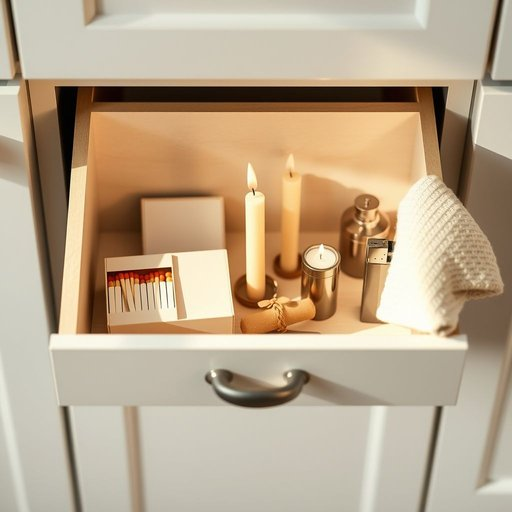

# matches

<h1 style="font-size: 2.5em; font-weight: 300; letter-spacing: 2px; margin: 0; color: #2c3e50;">
/ˈmæʧɪz/
</h1>

---

---

## 例句

Before the guests arrive this evening, I need you to check the drawer in the kitchen cabinet where we usually keep the matches, the candles, and the lighter to find something to light the fireplace.

*Before(/ˌbiˈfɔr/) the(/ðə/) guests(/gɛsts/) arrive(/əraɪv/) this(/ðɪs/) evening,(/ˈivnɪŋ,/) I(/aɪ/) need(/nid/) you(/ju/) to(/tɪ/) check(/ʧɛk/) the(/ðə/) drawer(/drɔr/) in(/ɪn/) the(/ðə/) kitchen(/ˈkɪʧən/) cabinet(/ˈkæbənət/) where(/wɛr/) we(/wi/) usually(/ˈjuʒəwəli/) keep(/kip/) the(/ðə/) matches,(/ˈmæʧɪz,/) the(/ðə/) candles,(/ˈkændəlz,/) and(/ənd/) the(/ðə/) lighter(/ˈlaɪtər/) to(/tɪ/) find(/faɪnd/) something(/ˈsəmθɪŋ/) to(/tɪ/) light(/laɪt/) the(/ðə/) fireplace.(/ˈfaɪərˌpleɪs./)*

**翻译：** 今晚客人到来之前，我需要你检查一下厨房橱柜里我们平时放火柴、蜡烛和打火机的抽屉，找些东西来点燃壁炉。

---

## 解释

单词“matches”作为家居生活用品场景中的名词，指的是“火柴”，即用来点燃火焰的小木棒或纸棒头部涂有易燃物质，通常用于生火、点燃蜡烛、炉子等。具体使用场合包括厨房、壁炉或露营时需要生火的环境，常见于表达“点火”、“用火柴点燃”等语境。在英语学习中，“matches”作名词时是“match”的复数形式，注意与动词“matches”保持区分，名词指具体物品，动词表示“匹配”“相配”等意义。常见搭配有“一盒火柴”（a box of matches）、“划燃一根火柴”（strike a match）等表达，学习者应注意“strike”在此处的特殊用法，意为“划燃”。此外，fire match一词较少用，通常直接说matches即可。在词源方面，matches源自古英语“mæċċan”意为“点燃”，后来引申为能引发火焰的小物件，最早的现代火柴发明于19世纪初，随工业革命普及。中文语境中，“matches”精准翻译为“火柴”，是一种生活基础用品，语义中性，无褒贬色彩，但在现代多被打火机取代，仍保留古朴和实用的文化象征意义。总体来说，理解“matches”不仅要掌握具体功能，还应注意其复数形式的语法区分及常用搭配，方能在家居生活语境中准确表达和理解。

---

<small style="color: #999; font-size: 0.9em;">2025-07-17 06:22:40</small>

