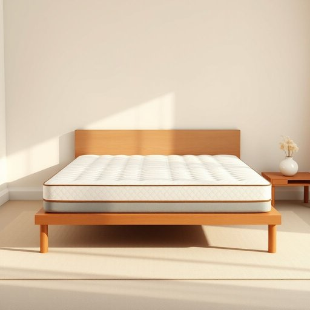

# mattress

<h1 style="font-size: 2.5em; font-weight: 300; letter-spacing: 2px; margin: 0; color: #2c3e50;">
/ˈmætrəs/
</h1>

---

---

## 例句

Before we decide on the bed frame, we should really test the mattress carefully, considering not only its firmness and thickness but also how well it supports the back during prolonged sleep, because a poor-quality mattress can affect both comfort and health significantly.

*Before(/ˌbiˈfɔr/) we(/wi/) decide(/ˌdɪˈsaɪd/) on(/ɔn/) the(/ðə/) bed(/bɛd/) frame,(/freɪm,/) we(/wi/) should(/ʃʊd/) really(/ˈrɪli/) test(/tɛst/) the(/ðə/) mattress(/ˈmætrəs/) carefully,(/ˈkɛrfəli,/) considering(/kənˈsɪdərɪŋ/) not(/nɑt/) only(/ˈoʊnli/) its(/ɪts/) firmness(/ˈfərmnəs/) and(/ənd/) thickness(/ˈθɪknəs/) but(/bət/) also(/ˈɔlsoʊ/) how(/haʊ/) well(/wɛl/) it(/ɪt/) supports(/səˈpɔrts/) the(/ðə/) back(/bæk/) during(/ˈdʊrɪŋ/) prolonged(/prəˈlɔŋd/) sleep,(/slip,/) because(/bɪˈkəz/) a(/ə/) poor-quality(/poor-quality*/) mattress(/ˈmætrəs/) can(/kən/) affect(/əˈfɛkt/) both(/boʊθ/) comfort(/ˈkəmfərt/) and(/ənd/) health(/hɛlθ/) significantly.(/sɪgˈnɪfɪkəntli./)*

**翻译：** 在决定床架之前，我们应该认真测试床垫，不仅要考虑其硬度和厚度，还要关注它在长时间睡眠中对背部的支撑效果，因为劣质床垫会显著影响舒适度和健康。

---

## 解释

“mattress”作为名词主要指用于睡觉或休息时放置在床架上的软垫，即床垫，常见于卧室、宾馆、宿舍等家居或住宿环境中，主要功能是提供睡眠的舒适和支撑。英语学习者在使用“mattress”时要注意其不可数和可数用法通常为可数，表示一个床垫，如a mattress；而在表示总体概念时可用作不可数名词。常见搭配包括“memory foam mattress”（记忆海绵床垫）、“king-size mattress”（特大号床垫）、“spring mattress”（弹簧床垫）以及动词搭配如“buy a mattress”或“replace the mattress”。此外，“mattress”通常用于具体指物理床垫，避免与整体床架或床铺混淆。词源上，“mattress”源自阿拉伯语“matrah”，意为投掷的垫子，经过欧洲语言传入英语，最初指用于坐或睡的垫子，体现了中世纪东西方文化交流的历史背景。在中文语境中，“mattress”准确翻译为“床垫”，专指铺设在床架上、为人体提供支撑和舒适的软垫，与“床单”、“被子”等其他床上用品有明显区分，没有特殊褒贬含义或文化色彩，属于中性、日常生活用品词汇。使用时应避免与“mat”（席子）等词混淆，确保语境明确指睡觉用的床垫。

---

<small style="color: #999; font-size: 0.9em;">2025-07-17 06:22:40</small>

