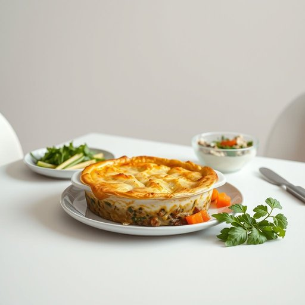

# meal

<h1 style="font-size: 2.5em; font-weight: 300; letter-spacing: 2px; margin: 0; color: #2c3e50;">
/mil/
</h1>

---

---

## 例句

After preparing the meal, which consisted of a homemade shepherd’s pie accompanied by freshly steamed vegetables and a side salad, she carefully placed it on the dining table, hoping that everyone would enjoy the flavours as much as she had enjoyed cooking it.

*After(/ˈæftər/) preparing(/pərˈpɛrɪŋ/) the(/ðə/) meal,(/mil,/) which(/wɪʧ/) consisted(/kənˈsɪstɪd/) of(/əv/) a(/ə/) homemade(/ˈhoʊˈmeɪd/) shepherd’s(/shepherd’s*/) pie(/paɪ/) accompanied(/əˈkəmpənid/) by(/baɪ/) freshly(/ˈfrɛʃli/) steamed(/stimd/) vegetables(/ˈvɛʤtəbəlz/) and(/ənd/) a(/ə/) side(/saɪd/) salad,(/ˈsæləd,/) she(/ʃi/) carefully(/ˈkɛrfəli/) placed(/pleɪst/) it(/ɪt/) on(/ɔn/) the(/ðə/) dining(/ˈdaɪnɪŋ/) table,(/ˈteɪbəl,/) hoping(/ˈhoʊpɪŋ/) that(/ðət/) everyone(/ˈɛvriˌwən/) would(/wʊd/) enjoy(/ˌɛnˈʤɔɪ/) the(/ðə/) flavours(/flavours*/) as(/ɛz/) much(/məʧ/) as(/ɛz/) she(/ʃi/) had(/hæd/) enjoyed(/ˌɛnˈʤɔɪd/) cooking(/ˈkʊkɪŋ/) it.(/ɪt./)*

**翻译：** 准备好饭菜后，她小心翼翼地将由自制牧羊人派、刚蒸好的蔬菜和一份配菜沙拉组成的餐点摆放在餐桌上，期盼大家能像她享受烹饪时那般，尽情品味其中的美味。

---

## 解释

英语单词“meal”作为名词，在家居生活用品的场景中主要指日常饮食中的“一餐”或“一顿饭”，通常用于描述家庭成员或者个人在家中进食的具体时间和食物集合，如早餐、午餐或晚餐。用法上，“meal”通常需要搭配具体的时间词，或者描述数量，如“三餐”，且常与动词“have”“eat”连用，例如“have a meal”。学习者需注意，“meal”通常指有一定分量和结构的正式饮食，不包括零食或饮料；此外，“meal”是可数名词，复数形式为“meals”，表示多顿饭。常见搭配还有“meal time”（用餐时间）、“ready meal”（方便餐）、“meal preparation”（备餐）等。词源方面，“meal”源自古英语“mæl”，原意是“时刻、约定的时间”，后来引申为“一定时间的饮食”，体现了饮食与时间的紧密联系。在中文语境中，“meal”准确翻译为“餐”或“一顿饭”，强调的是餐次而非具体食物，区别于“食物”或“菜肴”，因此理解时应注重其作为饮食事件的语义。该词本身无特别褒贬色彩，但在日常生活中，合理安排的“三餐”常与健康生活方式相联系，体现文化上对饮食规律的重要性。总之，“meal”在家居生活用品环境下是一个基础且常用的词汇，掌握其用法和搭配对于描述家庭饮食场景极为重要。

---

<small style="color: #999; font-size: 0.9em;">2025-07-17 06:22:40</small>

