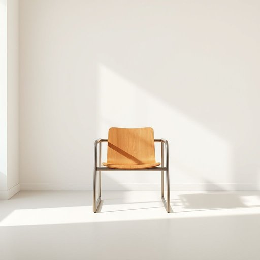

# metal

<h1 style="font-size: 2.5em; font-weight: 300; letter-spacing: 2px; margin: 0; color: #2c3e50;">
/ˈmɛtəl/
</h1>

---

---

## 例句

Could you please help me identify whether the frame of this old chair is made of metal or wood, because if the frame is metal, we might need to treat it differently to prevent rust and ensure it blends well with the rest of our living room décor?

*Could(/kʊd/) you(/ju/) please(/pliz/) help(/hɛlp/) me(/mi/) identify(/aɪˈdɛntəˌfaɪ/) whether(/ˈwɛðər/) the(/ðə/) frame(/freɪm/) of(/əv/) this(/ðɪs/) old(/oʊld/) chair(/ʧɛr/) is(/ɪz/) made(/meɪd/) of(/əv/) metal(/ˈmɛtəl/) or(/ər/) wood,(/wʊd,/) because(/bɪˈkəz/) if(/ɪf/) the(/ðə/) frame(/freɪm/) is(/ɪz/) metal,(/ˈmɛtəl,/) we(/wi/) might(/maɪt/) need(/nid/) to(/tɪ/) treat(/trit/) it(/ɪt/) differently(/ˈdɪfərˈɛntli/) to(/tɪ/) prevent(/prɪˈvɛnt/) rust(/rəst/) and(/ənd/) ensure(/ɪnˈʃʊr/) it(/ɪt/) blends(/blɛndz/) well(/wɛl/) with(/wɪθ/) the(/ðə/) rest(/rɛst/) of(/əv/) our(/ɑr/) living(/ˈlɪvɪŋ/) room(/rum/) décor?(/décor*?/)*

**翻译：** 您能帮我确认一下这把旧椅子的框架是金属材质还是木质的吗？因为如果是金属框架，我们可能需要采取不同的处理方式，以防止生锈，并确保它能与我们客厅的整体装修风格协调统一。

---

## 解释

英语单词"metal"在家居生活用品的语境中作为名词，主要指构成某些家具、厨具、装饰品或日常用品中的金属材料，如铁、钢、铜、铝等，比如"metal table"（金属桌子）、"metal utensils"（金属餐具）等，通常用于描述材料的质地和特性。英语学习者使用该词时应注意其作为可数名词时可用复数形式"metals"表示不同种类的金属，且在具体语境中常与表示物品或结构的名词搭配，如"metal frame"（金属框架）、"metal parts"（金属部件），此外，"metal"作为不可数名词时强调物质本身的特性，比如"Made of metal"（用金属制成），表达时需注意根据语境选择单复数形式。词源上，"metal"来自拉丁语"metallum"，意指矿物或矿石，后引申为使物体具备某些特性的金属材质，在现代英语中广泛用于指各种金属元素及其合金。中文语境中，"metal"准确翻译为“金属”，在家居用品领域主要指金属材质或相关制品，本身中性无褒贬含义，但在某些文化背景下金属材质可能被联想到坚固、耐用或工业感，具备一定的功能性和现代感，与木材、塑料等其他材料相对比时具有独特的质感和使用价值。

---

<small style="color: #999; font-size: 0.9em;">2025-07-17 06:22:40</small>

