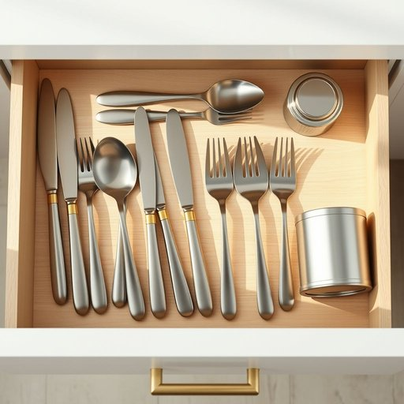

# metalware

<h1 style="font-size: 2.5em; font-weight: 300; letter-spacing: 2px; margin: 0; color: #2c3e50;">
/metalware*/
</h1>

---

---

## 例句

When organising the kitchen drawers, I realised that the assortment of metalware, which included everything from intricately designed tin canisters to sturdy stainless steel cutlery and decorative brass knobs, not only needed proper storage but also a thorough polish to restore its original shine.

*When(/wɪn/) organising(/organising*/) the(/ðə/) kitchen(/ˈkɪʧən/) drawers,(/drɔrz,/) I(/aɪ/) realised(/ˈriəˌlaɪzd/) that(/ðət/) the(/ðə/) assortment(/əˈsɔrtmənt/) of(/əv/) metalware,(/metalware*,/) which(/wɪʧ/) included(/ˌɪnˈkludɪd/) everything(/ˈɛvriˌθɪŋ/) from(/frəm/) intricately(/ˈɪntrəkətli/) designed(/dɪˈzaɪnd/) tin(/tɪn/) canisters(/ˈkænɪstərz/) to(/tɪ/) sturdy(/ˈstərdi/) stainless(/ˈsteɪnləs/) steel(/stil/) cutlery(/ˈkətləri/) and(/ənd/) decorative(/ˈdɛkrətɪv/) brass(/bræs/) knobs,(/nɑbz,/) not(/nɑt/) only(/ˈoʊnli/) needed(/ˈnidɪd/) proper(/ˈprɑpər/) storage(/ˈstɔrɪʤ/) but(/bət/) also(/ˈɔlsoʊ/) a(/ə/) thorough(/θəroʊ/) polish(/ˈpɑlɪʃ/) to(/tɪ/) restore(/rɪˈstɔr/) its(/ɪts/) original(/ərˈɪʤənəl/) shine.(/ʃaɪn./)*

**翻译：** 在整理厨房抽屉时，我意识到那批金属器具——从精致设计的锡制罐子，到坚固的不锈钢餐具，再到装饰性的黄铜旋钮——不仅需要妥善收纳，更需细心擦拭，以恢复其昔日的光泽。

---

## 解释

“metalware”作为名词在家居生活用品的语境中，指的是由金属制成的各种日用器具或装饰品，如餐具、厨具、水槽、灯具、门把手以及其他金属制家居用品等。具体使用场合通常出现在描述家庭装修、厨房设备、家具配件或购物目录中，强调产品材质为金属或包含金属元素。英语学习者在使用“metalware”时应注意其作为不可数名词或集合名词，通常不加复数形式，表达整体类别时使用；若指具体多种金属制品时，可以用复数形式“metalwares”，但较少见。此外，常见搭配包括“kitchen metalware”（厨房金属器具）、“silver metalware”（银制器皿）、“stainless steel metalware”（不锈钢制品）等，表达时可结合材质或功能词汇以增强准确性。该词源自英语“metal”（金属）与复合后缀“-ware”，后者源自古英语“waru”，意指某类器皿或商品，整体含义指以金属制作的器具，强调材质与用途相结合的概念。在中文语境中，“metalware”准确翻译为“金属制品”或“金属器皿”，侧重表示由金属材质制成的家用物品，不带有褒贬色彩，属于中性词汇，主要强调实用性和材质属性，在文化含义上无特殊负面或褒义倾向。

---

<small style="color: #999; font-size: 0.9em;">2025-07-17 06:22:40</small>

