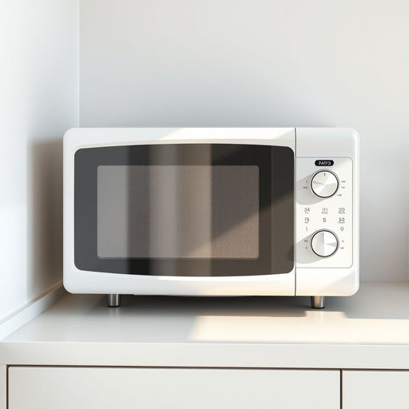

# microwave

<h1 style="font-size: 2.5em; font-weight: 300; letter-spacing: 2px; margin: 0; color: #2c3e50;">
/ˈmaɪkrəˌweɪv/
</h1>

---

---

## 例句

Could you please check if the microwave, which Mum bought last month because it has a sensor cooking feature and a spacious interior, is still working properly before we decide to heat up the leftovers or use the oven instead?

*Could(/kʊd/) you(/ju/) please(/pliz/) check(/ʧɛk/) if(/ɪf/) the(/ðə/) microwave,(/ˈmaɪkrəˌweɪv,/) which(/wɪʧ/) Mum(/məm/) bought(/bɔt/) last(/læst/) month(/mənθ/) because(/bɪˈkəz/) it(/ɪt/) has(/həz/) a(/ə/) sensor(/ˈsɛnsər/) cooking(/ˈkʊkɪŋ/) feature(/ˈfiʧər/) and(/ənd/) a(/ə/) spacious(/ˈspeɪʃəs/) interior,(/ˌɪnˈtɪriər,/) is(/ɪz/) still(/stɪl/) working(/ˈwərkɪŋ/) properly(/ˈprɑpərli/) before(/ˌbiˈfɔr/) we(/wi/) decide(/ˌdɪˈsaɪd/) to(/tɪ/) heat(/hit/) up(/əp/) the(/ðə/) leftovers(/ˈlɛfˌtoʊvərz/) or(/ər/) use(/juz/) the(/ðə/) oven(/ˈəvən/) instead?(/ˌɪnˈstɛd?/)*

**翻译：** 你能帮忙检查一下上个月妈妈买的那台带有感应烹饪功能且内部空间宽敞的微波炉是否仍然正常工作吗？这样我们才能决定是加热剩菜还是改用烤箱。

---

## 解释

microwave作为名词在家居生活用品的语境中，指的是微波炉，一种利用微波辐射加热食物的厨房电器，常见于家庭、办公室等日常环境，用于快速加热和烹饪食物。英语学习者在使用microwave时需注意其作为可数名词使用，可与冠词连用，如a microwave或the microwave，表示具体某台微波炉，且常见搭配包括microwave oven（微波炉的全称）、use the microwave（使用微波炉）、microwave meals（微波加热的食品）等。表达时可以用heat something in the microwave（在微波炉里加热某物）等结构，但不宜直接说microwave something作为动词，除非已熟悉其动词用法。词源方面，microwave源自英文micro-（微小的）和wave（波），指的是电磁频谱中波长较短的微波，微波炉正是利用这一波段的电磁波原理进行加热。中文语境中，microwave准确翻译为微波炉，强调的是利用微波技术的家用电器，无特殊褒贬色彩，属于中性词汇，反映现代科技在家庭生活中的应用，文化内涵主要体现为便捷、高效的饮食习惯变迁。

---

<small style="color: #999; font-size: 0.9em;">2025-07-17 06:22:40</small>

