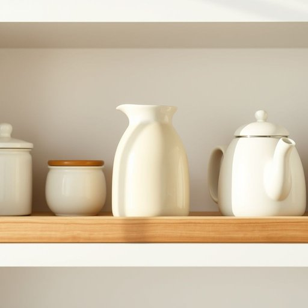

# milk-jug

<h1 style="font-size: 2.5em; font-weight: 300; letter-spacing: 2px; margin: 0; color: #2c3e50;">
/milk-jug*/
</h1>

---

---

## 例句

Could you please hand me the ceramic milk-jug that rests on the kitchen shelf beside the sugar bowl and teapot, as I need to pour fresh milk into my tea before breakfast?

*Could(/kʊd/) you(/ju/) please(/pliz/) hand(/hænd/) me(/mi/) the(/ðə/) ceramic(/sərˈæmɪk/) milk-jug(/milk-jug*/) that(/ðət/) rests(/rɛsts/) on(/ɔn/) the(/ðə/) kitchen(/ˈkɪʧən/) shelf(/ʃɛlf/) beside(/ˌbiˈsaɪd/) the(/ðə/) sugar(/ˈʃʊgər/) bowl(/boʊl/) and(/ənd/) teapot,(/ˈtiˌpɑt,/) as(/ɛz/) I(/aɪ/) need(/nid/) to(/tɪ/) pour(/pɔr/) fresh(/frɛʃ/) milk(/mɪlk/) into(/ˈɪntu/) my(/maɪ/) tea(/ti/) before(/ˌbiˈfɔr/) breakfast?(/ˈbrɛkfəst?/)*

**翻译：** 请您帮我拿一下放在厨房架子上、糖罐和茶壶旁边的陶瓷奶罐，我想在早餐前往茶里倒些新鲜牛奶。

---

## 解释

英语名词“milk-jug”指的是一种专门用于盛放和倒奶的容器，通常用于家庭厨房或餐桌上，尤其是在早餐或茶歇时将牛奶从冷藏状态倒入咖啡、茶或其他饮品中。使用场合多为日常生活中的饮食场景，语境较为具体和实用，涉及到餐具或饮品配料等方面。学习者在使用“milk-jug”时应注意其构成是复合名词，由“milk”（牛奶）和“jug”（壶、罐）组成，通常作为单数形式出现，复数时加-s即“milk-jugs”。语法上，它作为可数名词，符合一般名词的数和冠词搭配规则，如a milk-jug或the milk-jug；在表达技巧上，常见的搭配包括“a ceramic milk-jug”（陶瓷奶壶）、“a small milk-jug”（小奶壶）等，描述具体材质或大小时多用形容词修饰。词源方面，“jug”源自古英语“cugge”，意指一种盛液体的容器，“milk-jug”则自然衔接为专门盛牛奶的壶，体现出英语中通过组合词形成具体物品名称的惯例。在中文语境中，“milk-jug”准确翻译为“奶壶”或“盛奶壶”，强调盛放牛奶的专用壶，与一般水壶或饮料壶有所区别，无明显褒贬或特殊文化色彩，但在西方餐饮文化中，奶壶常体现家庭生活的温馨细节和餐桌礼仪，因此使用时多带有亲切、实用的生活气息。

---

<small style="color: #999; font-size: 0.9em;">2025-07-17 06:22:40</small>

