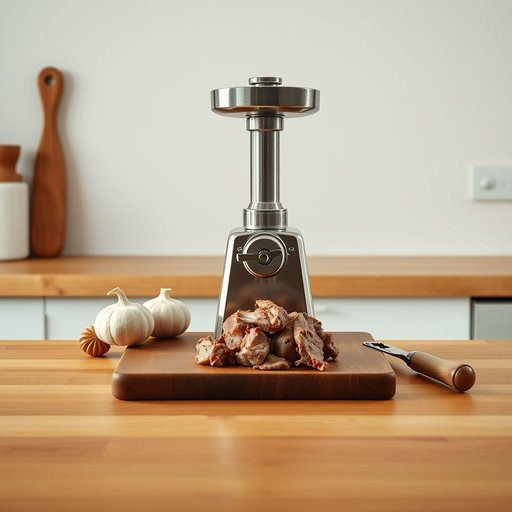

# mincer

<h1 style="font-size: 2.5em; font-weight: 300; letter-spacing: 2px; margin: 0; color: #2c3e50;">
/ˈmɪnsər/
</h1>

---

---

## 例句

Could you please pass me the mincer that’s tucked away in the top drawer next to the garlic crusher and the nutcracker, so I can finely chop the beef for the shepherd’s pie before we start preparing the mashed potatoes and vegetables?

*Could(/kʊd/) you(/ju/) please(/pliz/) pass(/pæs/) me(/mi/) the(/ðə/) mincer(/ˈmɪnsər/) that’s(/that’s*/) tucked(/təkt/) away(/əˈweɪ/) in(/ɪn/) the(/ðə/) top(/tɔp/) drawer(/drɔr/) next(/nɛkst/) to(/tɪ/) the(/ðə/) garlic(/ˈgɑrlɪk/) crusher(/ˈkrəʃər/) and(/ənd/) the(/ðə/) nutcracker,(/ˈnətˌkrækər,/) so(/soʊ/) I(/aɪ/) can(/kən/) finely(/ˈfaɪnli/) chop(/ʧɑp/) the(/ðə/) beef(/bif/) for(/fər/) the(/ðə/) shepherd’s(/shepherd’s*/) pie(/paɪ/) before(/ˌbiˈfɔr/) we(/wi/) start(/stɑrt/) preparing(/pərˈpɛrɪŋ/) the(/ðə/) mashed(/mæʃt/) potatoes(/pəˈteɪtoʊz/) and(/ənd/) vegetables?(/ˈvɛʤtəbəlz?/)*

**翻译：** 你能把藏在顶部抽屉里、靠近压蒜器和坚果夹的绞肉机递给我吗？我想用它把牛肉绞细，为牧羊人派做准备，随后我们再开始准备土豆泥和蔬菜。

---

## 解释

“mincer”作为名词在家居生活用品的英语语境中，通常指的是一种用于绞碎肉类或其他食材的厨房用具，即“绞肉机”或“肉馅机”。这个词常见于烹饪、厨房设备相关的对话和文本中，使用场合多为家庭厨房或餐饮业。英语学习者在使用“mincer”时需注意，它是一个可数名词，复数形式为“mincers”，通常与动词搭配使用时遵循常规第三人称单数动词形式，例如“The mincer works well.”此外，常见搭配有“electric mincer”（电动绞肉机）、“manual mincer”（手动绞肉机）等。词源上，“mincer”源自动词“mince”，意为切碎，起源可追溯至中世纪法语“mincier”，进一步源自拉丁语“minutiare”，含义为“切成小块”。在中文语境中，“mincer”最准确的翻译是“绞肉机”，指用于绞碎肉类的工具，理解时应注意其具体指代厨房用具，而非加工动作本身。该词通常中性无褒贬色彩，属于相对专业且具体的名词，文化内涵方面无特殊隐喻或象征意义，主要用于描述厨房生活用品，是现代家庭厨房常见设备之一。

---

<small style="color: #999; font-size: 0.9em;">2025-07-17 06:22:40</small>

