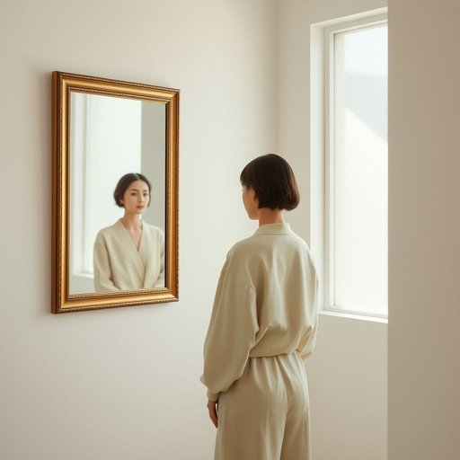

# mirror

<h1 style="font-size: 2.5em; font-weight: 300; letter-spacing: 2px; margin: 0; color: #2c3e50;">
/ˈmɪrər/
</h1>

---

---

## 例句

Before leaving the house, she paused in front of the ornate mirror hanging in the hallway, which not only reflected her carefully chosen outfit but also captured the soft morning light filtering through the frosted glass window.

*Before(/ˌbiˈfɔr/) leaving(/ˈlivɪŋ/) the(/ðə/) house,(/haʊs,/) she(/ʃi/) paused(/pɔzd/) in(/ɪn/) front(/frənt/) of(/əv/) the(/ðə/) ornate(/ɔrˈneɪt/) mirror(/ˈmɪrər/) hanging(/ˈhæŋɪŋ/) in(/ɪn/) the(/ðə/) hallway,(/ˈhɔlˌweɪ,/) which(/wɪʧ/) not(/nɑt/) only(/ˈoʊnli/) reflected(/rɪˈflɛktɪd/) her(/hər/) carefully(/ˈkɛrfəli/) chosen(/ˈʧoʊzən/) outfit(/ˈaʊtˌfɪt/) but(/bət/) also(/ˈɔlsoʊ/) captured(/ˈkæpʧərd/) the(/ðə/) soft(/sɔft/) morning(/ˈmɔrnɪŋ/) light(/laɪt/) filtering(/ˈfɪltərɪŋ/) through(/θru/) the(/ðə/) frosted(/ˈfrɔstɪd/) glass(/glæs/) window.(/ˈwɪndoʊ./)*

**翻译：** 临出门时，她在走廊上挂着的那面华丽的镜子前停下脚步，镜中不仅映出了她精心挑选的衣装，也映射出透过磨砂玻璃窗洒进的柔和晨光。

---

## 解释

英语单词“mirror”作为家居生活用品中的名词，指的是一种用来反射光线，使人能够看到自身或环境映像的平面或弧面玻璃制品，通常安装在卧室、浴室、走廊等处，便于个人整理仪容或装饰空间。在具体使用场合上，常见于描述家中墙壁上的梳妆镜、浴室镜柜或玄关处的全身镜等，语境多为家居布置、装修设计或日常生活用品。学习者在使用时需注意“mirror”作不可数名词较少，通常为可数名词，复数形式为“mirrors”；常见搭配有“wall mirror”（壁挂镜）、“bathroom mirror”（浴室镜）、“makeup mirror”（化妆镜）、“full-length mirror”（全身镜）等，此外，可以用于比喻义表示“反映、反射”某种情况或情绪，但在家居用品语境下无特别的褒贬色彩。词源上，“mirror”源自拉丁语“mirari”，意为“惊奇、注视”，经过中古法语“mirour”，最终进入英语，反映出其作为观照工具的本质。其在中文语境中的准确翻译是“镜子”，含义清晰且直接，与英文含义对应一致，通常指家中常见的用于照镜子的玻璃制品，无特别文化负载或情感色彩，是生活中极为普遍的用品和意象。

---

<small style="color: #999; font-size: 0.9em;">2025-07-17 06:22:40</small>

