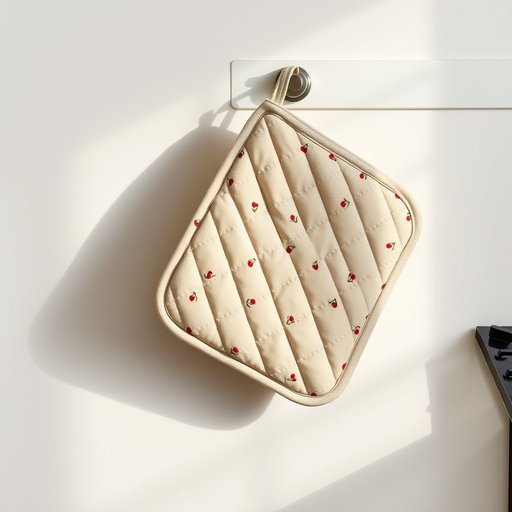

# mitt

<h1 style="font-size: 2.5em; font-weight: 300; letter-spacing: 2px; margin: 0; color: #2c3e50;">
/mɪt/
</h1>

---

---

## 例句

Could you please pass me the oven mitt that’s hanging by the stove, the one lined with the thickest quilted fabric and decorated with those tiny red cherries, because I need to take the roasting tray out of the oven before the chicken burns?

*Could(/kʊd/) you(/ju/) please(/pliz/) pass(/pæs/) me(/mi/) the(/ðə/) oven(/ˈəvən/) mitt(/mɪt/) that’s(/that’s*/) hanging(/ˈhæŋɪŋ/) by(/baɪ/) the(/ðə/) stove,(/stoʊv,/) the(/ðə/) one(/wən/) lined(/laɪnd/) with(/wɪθ/) the(/ðə/) thickest(/ˈθɪkɪst/) quilted(/kˈwɪltɪd/) fabric(/ˈfæbrɪk/) and(/ənd/) decorated(/ˈdɛkərˌeɪtɪd/) with(/wɪθ/) those(/ðoʊz/) tiny(/ˈtaɪni/) red(/rɛd/) cherries,(/ˈʧɛriz,/) because(/bɪˈkəz/) I(/aɪ/) need(/nid/) to(/tɪ/) take(/teɪk/) the(/ðə/) roasting(/ˈroʊstɪŋ/) tray(/treɪ/) out(/aʊt/) of(/əv/) the(/ðə/) oven(/ˈəvən/) before(/ˌbiˈfɔr/) the(/ðə/) chicken(/ˈʧɪkən/) burns?(/bərnz?/)*

**翻译：** 你能把挂在灶台旁的那个烤箱手套递给我吗？就是那个内里铺着最厚绗缝布、上面点缀着小红樱桃图案的，因为我需要用它把烤盘从烤箱里取出来，免得鸡肉烤糊了。

---

## 解释

英语单词“mitt”在家居生活用品语境中作为名词，通常指一种手套状的物品，主要用来保护手部或方便抓握，常见的有厨房用的烤箱手套（oven mitt）或洗碗手套。具体使用场合通常是在烹饪、烤焙时为了防止烫伤，或在清洁、洗碗时保护手部皮肤。英语学习者在使用“mitt”时需注意，它通常与特定名词构成复合词，如“oven mitt”，且“mitt”本身多用于指较大而宽松的手套，不常单独使用形容具体细节，另外，“mitt”作名词时通常为可数名词，需根据具体数量变化复数形式“mitts”。词源上，“mitt”起源于中古英语“mite”或“mitten”，源自古英语，最初指一种宽松的手套，强调覆盖全掌但不分指头，这种设计源于实用需要，防止寒冷或伤害。中文语境中“mitt”准确翻译为“手套”或“隔热手套”，具体环境下多译为“烤箱手套”或“厨房手套”，避免混淆为一般的手套（glove），因为“mitt”通常指不分指的套型手套。在文化内涵上，“mitt”多为中性词，使用时无褒贬色彩，但因其在运动领域（如棒球手套）和家居不同语境中存在不同含义，需结合上下文理解。总体而言，“mitt”在家居用品中是指保护性手套，强调实用性和宽松设计，使用时注意与相关复合词搭配。

---

<small style="color: #999; font-size: 0.9em;">2025-07-17 06:22:40</small>

