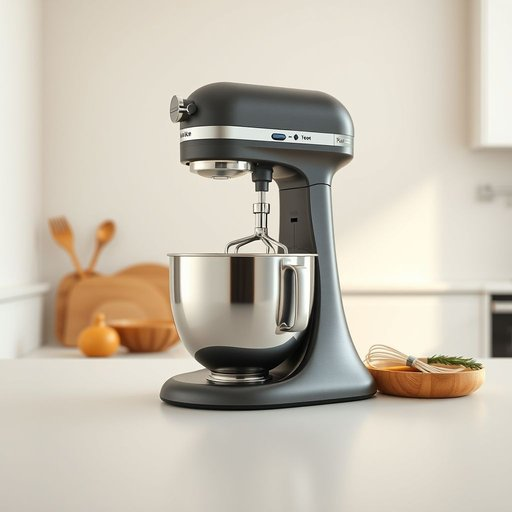

# mixer

<h1 style="font-size: 2.5em; font-weight: 300; letter-spacing: 2px; margin: 0; color: #2c3e50;">
/ˈmɪksər/
</h1>

---

---

## 例句

Despite the numerous challenges they faced, the determination and resilience demonstrated by the team, particularly when navigating the complex financial regulations that were imposed unexpectedly, showcased their unparalleled ability to adapt and innovate under pressure.

*Despite(/dɪˈspaɪt/) the(/ðə/) numerous(/ˈnumərəs/) challenges(/ˈʧælənʤɪz/) they(/ðeɪ/) faced,(/feɪst,/) the(/ðə/) determination(/dɪˌtərməˈneɪʃən/) and(/ənd/) resilience(/rɪˈzɪljəns/) demonstrated(/ˈdɛmənˌstreɪtɪd/) by(/baɪ/) the(/ðə/) team,(/tim,/) particularly(/ˌpɑrˈtɪkjələrli/) when(/wɪn/) navigating(/ˈnævəˌgeɪtɪŋ/) the(/ðə/) complex(/ˈkɑmplɛks/) financial(/ˌfaɪˈnænʃəl/) regulations(/ˌrɛgjəˈleɪʃənz/) that(/ðət/) were(/wər/) imposed(/ˌɪmˈpoʊzd/) unexpectedly,(/ˌənɪkˈspɛktɪdli,/) showcased(/ˈʃoʊˌkeɪst/) their(/ðɛr/) unparalleled(/ənˈpɛrəˌlɛld/) ability(/əˈbɪləˌti/) to(/tɪ/) adapt(/əˈdæpt/) and(/ənd/) innovate(/ˈɪnəˌveɪt/) under(/ˈəndər/) pressure.(/ˈprɛʃər./)*

**翻译：** 尽管面临诸多挑战，团队展现出的坚定决心与韧性，尤其在应对突如其来的复杂金融法规时，更凸显了他们在压力下卓越的适应与创新能力。

---

## 解释

英语单词“mixer”在家居生活用品的语境中，作为名词主要指用来搅拌、混合食材的电动或手动工具，常见于厨房，如电动搅拌机（electric mixer）和手持搅拌器（hand mixer），其具体使用场合包括制作面糊、蛋白霜或调制饮品等厨房操作。学习者在使用时要注意，“mixer”作为可数名词，复数形式为“mixers”，且常与表示用途的词连用，如“stand mixer”（搅拌台），或定语修饰，如“kitchen mixer”；此外，它在句中作主语或宾语均较常见。该词源自动词“mix”的派生名词，意指混合物或混合工具，起初指任何用于混合的机械装置，后来专指厨房及音响设备中的搅拌或调音器具。在中文语境中，准确翻译为“搅拌机”或“搅拌器”，强调其功能性和厨房应用，通常不带有褒贬色彩，但需根据具体设备形态区别名称，以避免混淆其他类型的“混音器”等非家用含义。整体来看，“mixer”是厨房常用的实用工具词汇，表达清晰且实用，使用时注意其具体类别和搭配即可正确理解和应用。

---

<small style="color: #999; font-size: 0.9em;">2025-07-17 06:22:40</small>

