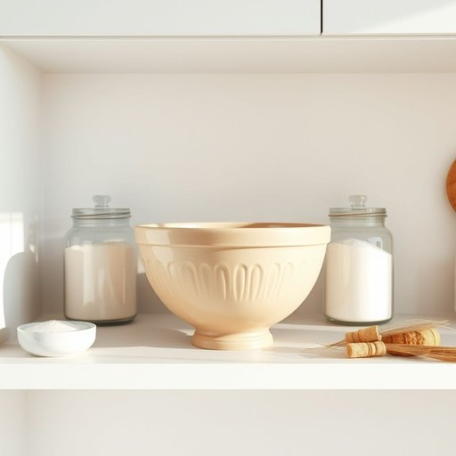

# mixing-bowl

<h1 style="font-size: 2.5em; font-weight: 300; letter-spacing: 2px; margin: 0; color: #2c3e50;">
/mixing-bowl*/
</h1>

---

---

## 例句

Before we start baking, could you please hand me the large mixing-bowl that’s usually kept on the top shelf next to the flour and sugar, since it’s perfect for combining all the ingredients thoroughly without spilling anything onto the countertop?

*Before(/ˌbiˈfɔr/) we(/wi/) start(/stɑrt/) baking,(/ˈbeɪkɪŋ,/) could(/kʊd/) you(/ju/) please(/pliz/) hand(/hænd/) me(/mi/) the(/ðə/) large(/lɑrʤ/) mixing-bowl(/mixing-bowl*/) that’s(/that’s*/) usually(/ˈjuʒəwəli/) kept(/kɛpt/) on(/ɔn/) the(/ðə/) top(/tɔp/) shelf(/ʃɛlf/) next(/nɛkst/) to(/tɪ/) the(/ðə/) flour(/flaʊər/) and(/ənd/) sugar,(/ˈʃʊgər,/) since(/sɪns/) it’s(/it’s*/) perfect(/ˈpərˌfɪkt/) for(/fər/) combining(/kəmˈbaɪnɪŋ/) all(/ɔl/) the(/ðə/) ingredients(/ˌɪnˈgridiənts/) thoroughly(/ˈθəroʊli/) without(/wɪˈθaʊt/) spilling(/ˈspɪlɪŋ/) anything(/ˈɛniˌθɪŋ/) onto(/ˈɔntu/) the(/ðə/) countertop?(/ˈkaʊntərˌtɑp?/)*

**翻译：** 在我们开始烘焙之前，能否请你把通常放在顶层货架上、靠近面粉和糖的大搅拌碗递给我？它非常适合将所有食材充分混合，且不会洒落到台面上。

---

## 解释

英语单词"mixing-bowl"作为名词，指的是厨房中用来混合食材的碗，通常材质为玻璃、陶瓷、不锈钢或塑料，广泛用于烘焙、烹饪准备等家居生活场合，如搅拌面糊、调制沙拉或腌制食材。英语学习者在使用该词时需注意其复合名词结构，通常是名词+名词形式，且多为可数名词，应根据具体数量加复数形式"mixing-bowls"；此外，该词通常用作具体物品的称呼，很少用于抽象或比喻意义，常见搭配包括动词“use a mixing-bowl”（使用搅拌碗）、"pour into the mixing-bowl"（倒入搅拌碗中）等，并可与厨房相关形容词连用，如“large mixing-bowl”。词源方面，"mixing-bowl"由动词"mixing"（混合）与名词"bowl"（碗）直接组合而成，体现物品用途的直观描述，并无特殊文化隐喻或历史典故。中文语境中，“mixing-bowl”准确的翻译为“搅拌碗”或“混合碗”，指专门用来混合各种食材的器具，理解时侧重其厨房工具功能，通常不带有褒贬色彩或特殊情感意味，属于中性、实用型词汇，适合家居、烹饪等生活场合表达。

---

<small style="color: #999; font-size: 0.9em;">2025-07-17 06:22:40</small>

