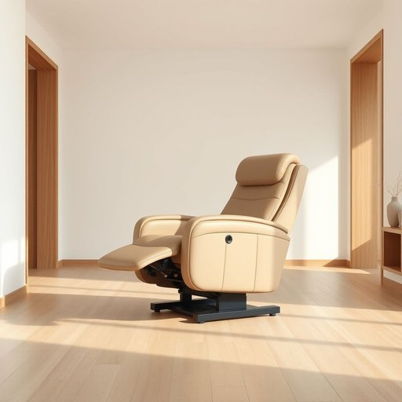

# mobility

<h1 style="font-size: 2.5em; font-weight: 300; letter-spacing: 2px; margin: 0; color: #2c3e50;">
/moʊˈbɪlɪti/
</h1>

---

---

## 例句

Considering her reduced mobility, we decided to invest in a state-of-the-art recliner chair with adjustable height and built-in massage features, not only to enhance her comfort but also to ensure safety around the house where slippery floors and narrow hallways can pose significant challenges.

*Considering(/kənˈsɪdərɪŋ/) her(/hər/) reduced(/rɪˈdust/) mobility,(/moʊˈbɪlɪti,/) we(/wi/) decided(/ˌdɪˈsaɪdɪd/) to(/tɪ/) invest(/ˌɪnˈvɛst/) in(/ɪn/) a(/ə/) state-of-the-art(/ˌsteɪtəvðɪˈɑrt/) recliner(/rɪˈklaɪnər/) chair(/ʧɛr/) with(/wɪθ/) adjustable(/əˈʤəstəbəl/) height(/haɪt/) and(/ənd/) built-in(/ˈbɪlˌtɪn/) massage(/məˈsɑʒ/) features,(/ˈfiʧərz,/) not(/nɑt/) only(/ˈoʊnli/) to(/tɪ/) enhance(/ɛnˈhæns/) her(/hər/) comfort(/ˈkəmfərt/) but(/bət/) also(/ˈɔlsoʊ/) to(/tɪ/) ensure(/ɪnˈʃʊr/) safety(/ˈseɪfti/) around(/əraʊnd/) the(/ðə/) house(/haʊs/) where(/wɛr/) slippery(/sˈlɪpəri/) floors(/flɔrz/) and(/ənd/) narrow(/ˈnɛroʊ/) hallways(/ˈhɔlˌweɪz/) can(/kən/) pose(/poʊz/) significant(/sɪgˈnɪfɪkənt/) challenges.(/ˈʧælənʤɪz./)*

**翻译：** 鉴于她行动不便，我们决定购置一款配备高度调节和内置按摩功能的先进躺椅，不仅为了提升她的舒适感，更是为了在地板湿滑、走廊狭窄等存在重大安全隐患的家中保障她的安全。

---

## 解释

“mobility”作为名词，在家居生活用品的英文语境中通常指的是“行动的能力”或“移动的便捷性”，常用于描述老年人、残障人士或需要辅助设备时如何方便在家中活动，例如“enhancing mobility with walking aids”（通过助步器提升行动能力），体现了产品帮助改善使用者自由移动的功能。在具体使用场合，这个词多出现在与无障碍设计、健康护理用品（如轮椅、助步器、防滑垫）相关的讨论中，强调使用者在家居环境中的自如移动。学习者在使用“mobility”时应注意其为不可数名词，通常不加复数形式，且常与形容词或介词短语搭配，如“limited mobility”（行动受限）、“mobility aid”（行动辅助器具）等。其搭配还包括“enhance/improve mobility”（提升行动能力）、“reduce mobility”（降低行动能力）等表达。词源方面，“mobility”源自拉丁语“mobilis”，意为“可移动的”，经法语进入英语，传达了“可移动性”这一概念。在中文语境中，“mobility”对应的准确翻译多为“行动能力”、“移动性”或“机动性”，根据上下文进行调整，确保表达的是主体能否方便地在空间内移动的意义。此词本身无明显褒贬色彩，属于中性词，但在特定语境下，如“limited mobility”常带有身体功能受限的负面含义，反映的是对行动不便的客观描述。总之，“mobility”在家居生活用品领域侧重于描述用户行动自如的能力及相关辅助设备的功能，是表达生活便利性和改善生活质量的重要术语。

---

<small style="color: #999; font-size: 0.9em;">2025-07-17 06:22:40</small>

