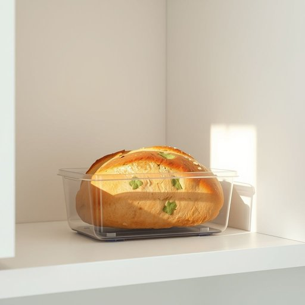

# mold

<h1 style="font-size: 2.5em; font-weight: 300; letter-spacing: 2px; margin: 0; color: #2c3e50;">
/moʊld/
</h1>

---

---

## 例句

Despite the airtight container and the cool temperature in the kitchen, the bread loaf in the cupboard started developing a green mold that seemed to thrive in the humid corner where we usually store baked goods.

*Despite(/dɪˈspaɪt/) the(/ðə/) airtight(/ˈɛrˌtaɪt/) container(/kənˈteɪnər/) and(/ənd/) the(/ðə/) cool(/kul/) temperature(/ˈtɛmpərəʧər/) in(/ɪn/) the(/ðə/) kitchen,(/ˈkɪʧən,/) the(/ðə/) bread(/brɛd/) loaf(/loʊf/) in(/ɪn/) the(/ðə/) cupboard(/ˈkəbərd/) started(/ˈstɑrtɪd/) developing(/dɪˈvɛləpɪŋ/) a(/ə/) green(/grin/) mold(/moʊld/) that(/ðət/) seemed(/simd/) to(/tɪ/) thrive(/θraɪv/) in(/ɪn/) the(/ðə/) humid(/ˈjumɪd/) corner(/ˈkɔrnər/) where(/wɛr/) we(/wi/) usually(/ˈjuʒəwəli/) store(/stɔr/) baked(/beɪkt/) goods.(/gʊdz./)*

**翻译：** 尽管面包被密封在密闭的容器中，厨房温度也较为凉爽，但储物柜里的面包仍开始长出绿色霉菌，这些霉菌似乎特别喜欢我们通常放置烘焙食品的那个湿润角落。

---

## 解释

英语单词mold作为名词在家居生活用品的语境中通常指模具即用来成型或制作某种形状物品的工具或容器如制作蛋糕的模具肥皂模具等具体使用场合包括烘焙手工艺品制作塑料或金属铸造等常见表达有cake mold蛋糕模具ice mold冰块模具soap mold肥皂模具等英语学习者在使用mold时应注意其拼写和发音以及与动词to mold塑造发霉区分名词形式多指模具或霉菌根据上下文区分意义此外常见的搭配还有silicone mold硅胶模具metal mold金属模具等词源方面mold源自古英语molde或mould最初含义与土壤形状有关后来引申为模具和霉菌中文环境中mold作为家居用品时应准确译为模具避免与表示霉菌的霉混淆需要注意的是mold作为霉菌时带有一定的负面色彩容易引起卫生和健康问题而作为模具的含义则属于中性不含褒贬总体而言在家居用品语境中使用mold指模具是较为常见且实用的表达学习者应根据具体场景辨别其含义并恰当运用

---

<small style="color: #999; font-size: 0.9em;">2025-07-17 06:22:40</small>

