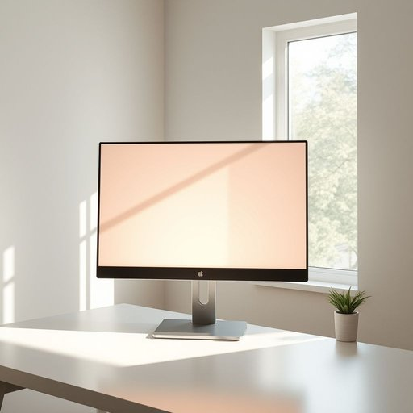

# monitor

<h1 style="font-size: 2.5em; font-weight: 300; letter-spacing: 2px; margin: 0; color: #2c3e50;">
/ˈmɑnətər/
</h1>

---

---

## 例句

Before I start editing the photos from our holiday, could you please adjust the brightness and contrast on the new monitor in the study, which we recently set up next to the window to take advantage of natural light?

*Before(/ˌbiˈfɔr/) I(/aɪ/) start(/stɑrt/) editing(/ˈɛdɪtɪŋ/) the(/ðə/) photos(/ˈfoʊˌtoʊz/) from(/frəm/) our(/ɑr/) holiday,(/ˈhɑlɪˌdeɪ,/) could(/kʊd/) you(/ju/) please(/pliz/) adjust(/əˈʤəst/) the(/ðə/) brightness(/ˈbraɪtnəs/) and(/ənd/) contrast(/ˈkɑntræst/) on(/ɔn/) the(/ðə/) new(/nu/) monitor(/ˈmɑnətər/) in(/ɪn/) the(/ðə/) study,(/ˈstədi,/) which(/wɪʧ/) we(/wi/) recently(/ˈrisəntli/) set(/sɛt/) up(/əp/) next(/nɛkst/) to(/tɪ/) the(/ðə/) window(/ˈwɪndoʊ/) to(/tɪ/) take(/teɪk/) advantage(/ædˈvæntɪʤ/) of(/əv/) natural(/ˈnæʧərəl/) light?(/laɪt?/)*

**翻译：** 在我开始编辑我们假期拍摄的照片之前，能否请你调整一下书房中新安装的那台显示器的亮度和对比度？我们把它放在窗边，想借助自然光的优势。

---

## 解释

英语单词“monitor”在家居生活用品的语境中作为名词，通常指电子设备中的“显示器”或“屏幕”，例如计算机显示器、电视监视器等，用于显示图像、视频或信息。具体使用场合多见于家庭办公、娱乐或智能家居系统中，描述连接电脑或其他电子装置以进行视觉输出的设备。英语学习者在使用“monitor”时需注意其名词复数形式为“monitors”，且其作名词时一般是可数的；常见搭配有“computer monitor”（电脑显示器）、“LCD monitor”（液晶显示器）、“monitor screen”（监视屏幕）等。此外，作为动词时“monitor”有“监控、监测”之义，但在家居用品的名词用法中重点是指物理设备。词源方面，“monitor”源于拉丁语动词“monēre”，意为“提醒、警告”，最初指警告者，后来引申为监视、观察的工具或职位。中文语境中，“monitor”准确翻译为“显示器”“监视器”或“屏幕”，根据具体情境可灵活调整，无特别褒贬色彩，属于中性词汇，通常强调电子设备的功能属性和实用价值。整体来看，“monitor”作为家居生活用品的名词，强调其作为视觉信息展示工具的重要角色，是现代数字生活中不可或缺的设备。

---

<small style="color: #999; font-size: 0.9em;">2025-07-17 06:22:40</small>

