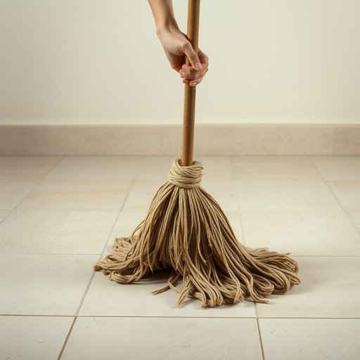

# mop

<h1 style="font-size: 2.5em; font-weight: 300; letter-spacing: 2px; margin: 0; color: #2c3e50;">
/mɑp/
</h1>

---

---

## 例句

After spilling the sauce all over the kitchen floor, she hurried to grab the mop, which, despite its somewhat worn-out appearance and frayed strands, proved incredibly effective at soaking up the mess and leaving the tiled surface spotless once she had finished wringing it out thoroughly.

*After(/ˈæftər/) spilling(/ˈspɪlɪŋ/) the(/ðə/) sauce(/sɔs/) all(/ɔl/) over(/ˈoʊvər/) the(/ðə/) kitchen(/ˈkɪʧən/) floor,(/flɔr,/) she(/ʃi/) hurried(/ˈhərid/) to(/tɪ/) grab(/græb/) the(/ðə/) mop,(/mɑp,/) which,(/wɪʧ,/) despite(/dɪˈspaɪt/) its(/ɪts/) somewhat(/ˈsəmˈwət/) worn-out(/worn-out*/) appearance(/əˈpɪrəns/) and(/ənd/) frayed(/freɪd/) strands,(/strændz,/) proved(/pruvd/) incredibly(/ˌɪnˈkrɛdəbli/) effective(/ˈifɛktɪv/) at(/æt/) soaking(/ˈsoʊkɪŋ/) up(/əp/) the(/ðə/) mess(/mɛs/) and(/ənd/) leaving(/ˈlivɪŋ/) the(/ðə/) tiled(/taɪld/) surface(/ˈsərfəs/) spotless(/ˈspɑtləs/) once(/wəns/) she(/ʃi/) had(/hæd/) finished(/ˈfɪnɪʃt/) wringing(/ˈrɪŋɪŋ/) it(/ɪt/) out(/aʊt/) thoroughly.(/ˈθəroʊli./)*

**翻译：** 她把酱汁洒了一地后，急忙去拿拖把。尽管拖把看起来有些破旧，刷毛也有些磨损，但它吸收污渍的效果非常出色，经过她认真拧干后，瓷砖地面变得一尘不染。

---

## 解释

英语单词mop作为名词在家居生活用品语境中主要指用于擦地的拖把，通常由长柄和吸水性强的布条或海绵组成，常见于清洁地板时使用。其具体使用场合包括家庭、办公室或任何需要湿拖地板的环境，通常在打扫卫生、清洁地面时提及。英语学习者需要注意的是，mop作为可数名词，单数形式为mop，复数形式为mops，常见搭配有wet mop（湿拖把）、dry mop（干拖把）和mop up（动词短语，意为擦干，收拾）。语法上，mop用作名词时通常与冠词连用，如a mop，the mop，也可作为动词使用，表示用拖把擦地，但两者需区别。词源上，mop起源于中古英语，源自大约14世纪的词汇，可能与中低地德语moppe相关，意指布团，用于清洁，反映了其实用功能的演变。中文语境中，mop准确翻译为拖把，强调其作为清洁工具的角色，没有特别褒贬含义，仅指向生活日常必备清洁用品，文化上无特殊色彩，属于中性词汇。整体来看，mop是描述家庭清洁中非常基础且常见的名词，掌握其词形变化及搭配对于英语学习者准确表达日常生活场景至关重要。

---

<small style="color: #999; font-size: 0.9em;">2025-07-17 06:22:40</small>

