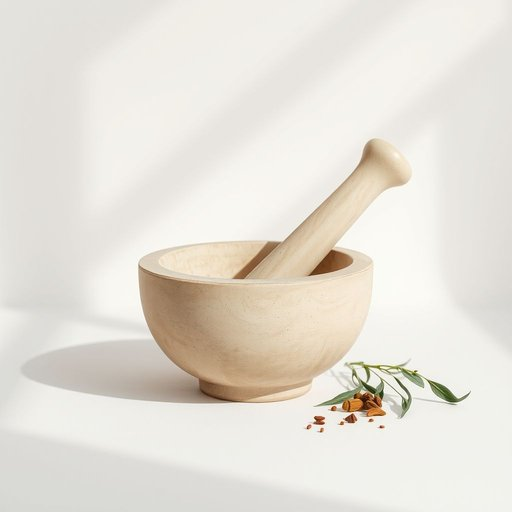

# mortar

<h1 style="font-size: 2.5em; font-weight: 300; letter-spacing: 2px; margin: 0; color: #2c3e50;">
/ˈmɔrtər/
</h1>

---

---

## 例句

Before we start tiling the kitchen backsplash, could you please check if the mortar in the garage is still usable, since it needs to be fresh and properly mixed with water, or else the tiles might not adhere correctly and could cause problems down the line?

*Before(/ˌbiˈfɔr/) we(/wi/) start(/stɑrt/) tiling(/tiling*/) the(/ðə/) kitchen(/ˈkɪʧən/) backsplash,(/backsplash*,/) could(/kʊd/) you(/ju/) please(/pliz/) check(/ʧɛk/) if(/ɪf/) the(/ðə/) mortar(/ˈmɔrtər/) in(/ɪn/) the(/ðə/) garage(/gərɑʒ/) is(/ɪz/) still(/stɪl/) usable,(/ˈjuzəbəl,/) since(/sɪns/) it(/ɪt/) needs(/nidz/) to(/tɪ/) be(/bi/) fresh(/frɛʃ/) and(/ənd/) properly(/ˈprɑpərli/) mixed(/mɪkst/) with(/wɪθ/) water,(/ˈwɔtər,/) or(/ər/) else(/ɛls/) the(/ðə/) tiles(/taɪlz/) might(/maɪt/) not(/nɑt/) adhere(/əˈdhɪr/) correctly(/kərˈɛktli/) and(/ənd/) could(/kʊd/) cause(/kɔz/) problems(/ˈprɑbləmz/) down(/daʊn/) the(/ðə/) line?(/laɪn?/)*

**翻译：** 在开始铺贴厨房瓷砖背景墙之前，您能否帮忙检查一下车库里的砂浆是否仍然可用？砂浆需要保持新鲜并与水充分混合，否则瓷砖可能无法牢固粘贴，日后可能会出现问题。

---

## 解释

英语单词“mortar”作为名词在家居生活用品的语境中，通常指的是一种用来研磨或捣碎调料、药材等的小型碗状器具，中文对应为“研钵”或“杵臼”的“钵”部分。具体使用场合包括厨房或中药材调配环境，使用者用杵在“mortar”中研磨原料以制备细粉或混合物。英语学习者在使用“mortar”时应注意其名词的单复数变化为“mortars”，且常见搭配有“mortar and pestle”，指成套使用的研钵和杵，这个短语是固定搭配，表示一种传统手工工具。此外，“mortar”在建筑领域还有“灰泥、砂浆”的意思，应根据语境区别理解。词源上，“mortar”来自拉丁语“mortarium”，意为用于捣碎的器具，随着时间传入古法语再到现代英语，保持了其研磨器皿的含义。在中文语境中，“mortar”准确翻译为“研钵”时，强调其实用工具属性，主要指厨房或药房中用来研磨的器皿，与现代机械化的搅拌器具形成对比，没有褒义或贬义色彩，属于中性、功能性的家居生活器具词汇。

---

<small style="color: #999; font-size: 0.9em;">2025-07-17 06:22:40</small>

