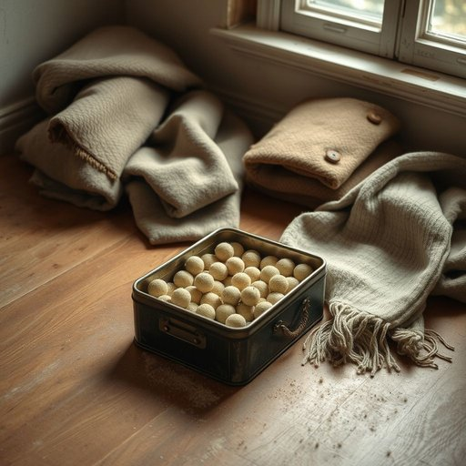

# mothball

<h1 style="font-size: 2.5em; font-weight: 300; letter-spacing: 2px; margin: 0; color: #2c3e50;">
/ˈmɔθˌbɔl/
</h1>

---

---

## 例句

When I was tidying up the attic yesterday, I found a dusty tin filled with mothballs, which, although pungent and somewhat off-putting, are absolutely essential for protecting my grandmother's vintage woollen coats and delicate embroidered scarves from being ruined by hungry insects during the long, humid summer months.

*When(/wɪn/) I(/aɪ/) was(/wɑz/) tidying(/tidying*/) up(/əp/) the(/ðə/) attic(/ˈætɪk/) yesterday,(/ˈjɛstərˌdeɪ,/) I(/aɪ/) found(/faʊnd/) a(/ə/) dusty(/ˈdəsti/) tin(/tɪn/) filled(/fɪld/) with(/wɪθ/) mothballs,(/ˈmɔθˌbɔlz,/) which,(/wɪʧ,/) although(/ˌɔlˈðoʊ/) pungent(/ˈpənʤənt/) and(/ənd/) somewhat(/ˈsəmˈwət/) off-putting,(/off-putting*,/) are(/ər/) absolutely(/ˌæbsəˈlutli/) essential(/ɛˈsɛnʃəl/) for(/fər/) protecting(/prəˈtɛktɪŋ/) my(/maɪ/) grandmother's(/ˈgrændˌməðərz/) vintage(/ˈvɪntɪʤ/) woollen(/ˈwʊlən/) coats(/koʊts/) and(/ənd/) delicate(/ˈdɛləkət/) embroidered(/ɛmˈbrɔɪdərd/) scarves(/skɑrvz/) from(/frəm/) being(/biɪŋ/) ruined(/ruɪnd/) by(/baɪ/) hungry(/ˈhəŋgri/) insects(/ˈɪnˌsɛkts/) during(/ˈdʊrɪŋ/) the(/ðə/) long,(/lɔŋ,/) humid(/ˈjumɪd/) summer(/ˈsəmər/) months.(/mənθs./)*

**翻译：** 昨天我在整理阁楼时，发现了一个装满樟脑丸的尘封铁盒。虽然樟脑丸气味刺鼻且让人不太舒服，但它们对保护我祖母那些复古的羊毛大衣和精致的刺绣围巾免受长时间潮湿夏季里饥饿昆虫的侵害却绝对必不可少。

---

## 解释

英语单词“mothball”作为名词在家居生活用品的语境中主要指“樟脑球”，这是一种小球状的化学物质，常用于防止衣物、织物或储藏物品受到蛀虫侵害。具体使用场合通常是在储存冬季大衣、毛衣、被褥等不常用的衣物或物品时，将其放置在衣柜、储物箱内以驱虫防蛀。英语学习者在使用“mothball”作为名词时需注意，它常与动词“put”，短语“in the mothballs”或“use mothballs”搭配，如“put clothes in mothballs”表示“把衣服用樟脑球保存起来”，同时需要区分“mothball”作为动词的含义（暂停使用或封存设施），这里侧重名词用法。词源方面，“mothball”源自19世纪，结合“moth”（蛾）和“ball”（球）的字面意义，即用来防蛀蛾的球形物品。中文中准确翻译为“樟脑球”，理解时要注意它是一种化学防虫剂，使用时需注意通风和避免直接接触皮肤，否则可能对健康有害。该词在中文语境中通常无褒贬含义，但因涉及化学品，现代家居生活中有时会用更安全的防虫手段替代，使用时需了解其潜在的化学风险和适用范围。

---

<small style="color: #999; font-size: 0.9em;">2025-07-17 06:22:40</small>

