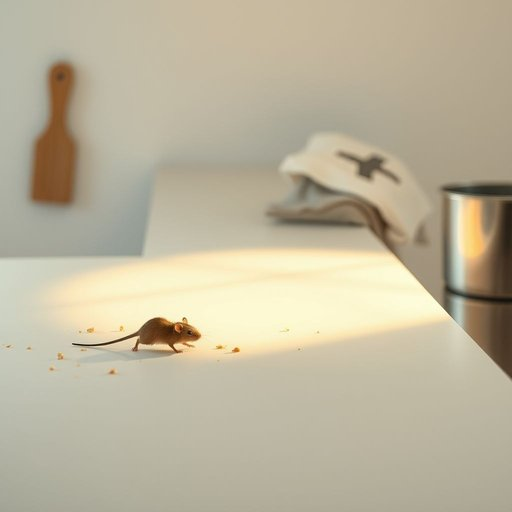

# mouse

<h1 style="font-size: 2.5em; font-weight: 300; letter-spacing: 2px; margin: 0; color: #2c3e50;">
/maʊs/
</h1>

---

---

## 例句

I heard a strange rustling sound coming from the kitchen last night, and when I went to investigate, I realised that a mouse, probably attracted by the crumbs left on the counter and the overflowing bin, had found its way inside the house, which means we’ll need to set some humane traps before it causes any more mischief.

*I(/aɪ/) heard(/hərd/) a(/ə/) strange(/streɪnʤ/) rustling(/ˈrəslɪŋ/) sound(/saʊnd/) coming(/ˈkəmɪŋ/) from(/frəm/) the(/ðə/) kitchen(/ˈkɪʧən/) last(/læst/) night,(/naɪt,/) and(/ənd/) when(/wɪn/) I(/aɪ/) went(/wɛnt/) to(/tɪ/) investigate,(/ˌɪnˈvɛstəˌgeɪt,/) I(/aɪ/) realised(/ˈriəˌlaɪzd/) that(/ðət/) a(/ə/) mouse,(/maʊs,/) probably(/ˈprɑbəˌbli/) attracted(/əˈtræktəd/) by(/baɪ/) the(/ðə/) crumbs(/krəmz/) left(/lɛft/) on(/ɔn/) the(/ðə/) counter(/ˈkaʊntər/) and(/ənd/) the(/ðə/) overflowing(/ˈoʊvərˌfloʊɪŋ/) bin,(/bɪn,/) had(/hæd/) found(/faʊnd/) its(/ɪts/) way(/weɪ/) inside(/ˌɪnˈsaɪd/) the(/ðə/) house,(/haʊs,/) which(/wɪʧ/) means(/minz/) we’ll(/we’ll*/) need(/nid/) to(/tɪ/) set(/sɛt/) some(/səm/) humane(/hjuˈmeɪn/) traps(/træps/) before(/ˌbiˈfɔr/) it(/ɪt/) causes(/ˈkɔzɪz/) any(/ˈɛni/) more(/mɔr/) mischief.(/ˈmɪsʧəf./)*

**翻译：** 昨晚我听到厨房传来一阵奇怪的沙沙声，去查看时发现是一只老鼠，可能是被台面上的面包屑和溢满的垃圾桶吸引，偷偷溜进了屋里。我们得先设些人道捕鼠器，以免它继续捣乱。

---

## 解释

单词“mouse”作为名词在家居生活用品的英语语境中，通常指“鼠标”，即计算机操作中用来指示和控制光标的手持设备，使用场合多见于电脑办公、家庭学习、电子娱乐等环境。英语学习者在使用“mouse”时需注意其复数形式为“mice”表示动物鼠类，但指代电脑配件时复数通常为“mice”或非正式情况下可用“mouses”，较标准的是“mice”，但“computer mice”更为常用和规范。此外，“mouse”作为可数名词，可以与定冠词、数量词连用，常见搭配如“a wireless mouse”（无线鼠标）、“a computer mouse”（电脑鼠标）、“mouse pad”（鼠标垫）等。词源上，“mouse”起源于古英语“mūs”，原指小型啮齿动物，因该设备形状与小鼠相似于20世纪末被借用命名，体现了形象比喻的语言特点。在中文语境中，“mouse”根据具体语境可译为“老鼠”或“鼠标”，家居生活用品场景下标准且准确的翻译为“鼠标”，不会带有褒贬或特殊文化色彩，只是生活中常见的电子设备名词，因此理解时需根据上下文区分动物和电子设备两种含义。

---

<small style="color: #999; font-size: 0.9em;">2025-07-17 06:22:40</small>

