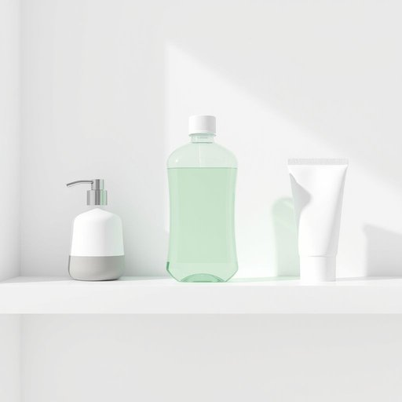

# mouthwash

<h1 style="font-size: 2.5em; font-weight: 300; letter-spacing: 2px; margin: 0; color: #2c3e50;">
/ˈmaʊθˌwɑʃ/
</h1>

---

---

## 例句

Before heading out to work, she reached for the mouthwash, which was nestled between the hand soap and the toothpaste on the bathroom shelf, knowing that its fresh, minty taste would not only eliminate any lingering bad breath but also leave her feeling confident throughout the busy day ahead.

*Before(/ˌbiˈfɔr/) heading(/ˈhɛdɪŋ/) out(/aʊt/) to(/tɪ/) work,(/wərk,/) she(/ʃi/) reached(/riʧt/) for(/fər/) the(/ðə/) mouthwash,(/ˈmaʊθˌwɑʃ,/) which(/wɪʧ/) was(/wɑz/) nestled(/ˈnɛsəld/) between(/bɪtˈwin/) the(/ðə/) hand(/hænd/) soap(/soʊp/) and(/ənd/) the(/ðə/) toothpaste(/ˈtuθˌpeɪst/) on(/ɔn/) the(/ðə/) bathroom(/ˈbæθˌrum/) shelf,(/ʃɛlf,/) knowing(/noʊɪŋ/) that(/ðət/) its(/ɪts/) fresh,(/frɛʃ,/) minty(/minty*/) taste(/teɪst/) would(/wʊd/) not(/nɑt/) only(/ˈoʊnli/) eliminate(/ɪˈlɪməˌneɪt/) any(/ˈɛni/) lingering(/ˈlɪŋgərɪŋ/) bad(/bæd/) breath(/brɛθ/) but(/bət/) also(/ˈɔlsoʊ/) leave(/liv/) her(/hər/) feeling(/ˈfilɪŋ/) confident(/ˈkɑnfədənt/) throughout(/θruaʊt/) the(/ðə/) busy(/ˈbɪzi/) day(/deɪ/) ahead.(/əˈhɛd./)*

**翻译：** 出门上班前，她伸手拿起浴室架子上夹在洗手液和牙膏之间的漱口水，知道这清新薄荷的味道不仅能消除残留的口臭，还能让她在接下来忙碌的一天里倍感自信。

---

## 解释

“mouthwash”作为名词在家居生活用品语境中指的是一种用于漱口的液体，通常含有抗菌成分，用以清洁口腔、杀灭细菌、去除口臭和维护口腔卫生。具体使用场合多见于日常口腔护理场景，如早晚刷牙后使用，或餐后清洁口腔时。英语学习者在使用该词时需注意它是一个可数名词，通常以复数形式“mouthwashes”出现时指多种不同类型或品牌的漱口水，且常与动词“use”搭配，如“use mouthwash”，或和形容词搭配描述其特点，如“antibacterial mouthwash”。此外，该词常出现在固定表达中如“rinse with mouthwash”。词源上，“mouth”意为“口”，而“wash”指“洗涤”，合成词直译为“口腔洗涤剂”，起源于英语中习惯将动作和对象结合构成功能性器物名称的传统。中文语境中，“mouthwash”准确翻译为“漱口水”，明确指代用于口腔健康的液体产品，在家庭和药店常见且普及。此词本身无褒贬含义，但在口腔护理文化中具有卫生健康的正面价值，反映出西方注重口腔日常护理的生活习惯，且作为消费品在卫生健康推广中具备一定社会认可度。

---

<small style="color: #999; font-size: 0.9em;">2025-07-17 06:22:40</small>

