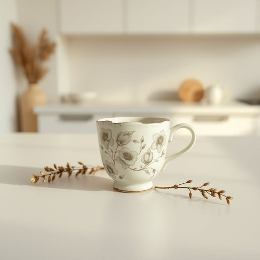

# mug

<h1 style="font-size: 2.5em; font-weight: 300; letter-spacing: 2px; margin: 0; color: #2c3e50;">
/məg/
</h1>

---

---

## 例句

Could you please put the chipped mug that’s been sitting by the sink, the one with the floral pattern that Grandma gave us last Christmas, into the dishwasher before you start preparing the tea?

*Could(/kʊd/) you(/ju/) please(/pliz/) put(/pʊt/) the(/ðə/) chipped(/ʧɪpt/) mug(/məg/) that’s(/that’s*/) been(/bɪn/) sitting(/ˈsɪtɪŋ/) by(/baɪ/) the(/ðə/) sink,(/sɪŋk,/) the(/ðə/) one(/wən/) with(/wɪθ/) the(/ðə/) floral(/ˈflɔrəl/) pattern(/ˈpætərn/) that(/ðət/) Grandma(/ˈgrændmɑ/) gave(/geɪv/) us(/ˈjuˈɛs/) last(/læst/) Christmas,(/ˈkrɪsməs,/) into(/ˈɪntu/) the(/ðə/) dishwasher(/ˈdɪʃˌwɑʃər/) before(/ˌbiˈfɔr/) you(/ju/) start(/stɑrt/) preparing(/pərˈpɛrɪŋ/) the(/ðə/) tea?(/ti?/)*

**翻译：** 在你开始准备茶水之前，能否请你把放在水槽边那个有花卉图案、去年圣诞奶奶送给我们的那只有缺口的杯子放进洗碗机里清洗？

---

## 解释

英语单词“mug”作为名词在家居生活用品的语境中，通常指一种带有把手的圆柱形杯子，主要用于喝茶、咖啡、热巧克力等热饮，常见于厨房、餐厅或办公环境。使用场合多为日常饮用热饮时，语境通常较为轻松和生活化。学习者在使用“mug”作为名词时应注意其可数性，通常使用复数形式“mugs”，且常见搭配有“coffee mug”（咖啡杯）、“ceramic mug”（陶瓷杯）、“travel mug”（旅行杯）等。此外，“mug”一词常用于描述杯子的材质、容量或用途，如“一大杯茶”。词源方面，“mug”源自古英语“mugge”，意指一种装液体的杯子，起初用于指带把手的饮具，演变至今仍保持原义。中文语境中，“mug”准确翻译为“马克杯”或“带把手的大杯子”，强调其实用性和平常性。需要注意的是，除家居用品含义外，“mug”在英语里还有俚语含义，指“傻瓜”或“易受骗的人”，属于带有贬义的用法，这与家居用品意义完全不同，因此学习者应根据上下文准确判断，避免混淆。总的来说，在家居生活用品语境中，“mug”是一个中性、常用且具体指代带把手的饮杯词汇。

---

<small style="color: #999; font-size: 0.9em;">2025-07-17 06:22:40</small>

