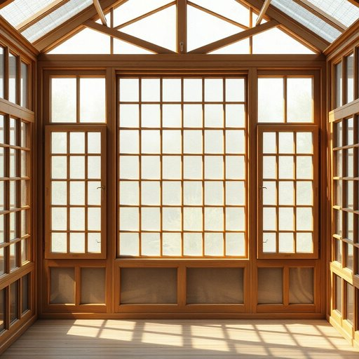

# mullion

<h1 style="font-size: 2.5em; font-weight: 300; letter-spacing: 2px; margin: 0; color: #2c3e50;">
/mullion*/
</h1>

---

---

## 例句

When we decided to renovate the old conservatory, we carefully preserved the original wooden mullion, which not only adds a charming vintage character to the windows but also supports the multiple panes of glass that let in the soft afternoon light.

*When(/wɪn/) we(/wi/) decided(/ˌdɪˈsaɪdɪd/) to(/tɪ/) renovate(/ˈrɛnəˌveɪt/) the(/ðə/) old(/oʊld/) conservatory,(/kənˈsərvətɔri,/) we(/wi/) carefully(/ˈkɛrfəli/) preserved(/prɪˈzərvd/) the(/ðə/) original(/ərˈɪʤənəl/) wooden(/ˈwʊdən/) mullion,(/mullion*,/) which(/wɪʧ/) not(/nɑt/) only(/ˈoʊnli/) adds(/ædz/) a(/ə/) charming(/ˈʧɑrmɪŋ/) vintage(/ˈvɪntɪʤ/) character(/ˈkɛrɪktər/) to(/tɪ/) the(/ðə/) windows(/ˈwɪndoʊz/) but(/bət/) also(/ˈɔlsoʊ/) supports(/səˈpɔrts/) the(/ðə/) multiple(/ˈməltəpəl/) panes(/peɪnz/) of(/əv/) glass(/glæs/) that(/ðət/) let(/lɛt/) in(/ɪn/) the(/ðə/) soft(/sɔft/) afternoon(/ˌæftərˈnun/) light.(/laɪt./)*

**翻译：** 当我们决定翻修这座老旧的温室时，特意保留了原有的木质窗框，这不仅为窗户增添了迷人的复古韵味，也稳固支撑着多扇玻璃，使得柔和的午后阳光得以洒入。

---

## 解释

英语单词“mullion”在家居生活用品领域作为名词，主要指窗户或门框中用于分隔和支撑玻璃的小立柱或横梁，通常是由木材、石材或金属制成的坚固构件，具体使用场合多见于描述窗户结构、建筑设计或装修中，如“a window with stone mullions”（有石质窗框分隔柱的窗户）。“mullion”作为可数名词一般用复数形式“mullions”，英语学习者在使用时需注意该词常与“window”、“glass”、“frame”等词搭配，表达窗户分栏结构时尤为常见，语法上通常作名词出现，作定语修饰其他名词时也可用，如“mullion bars”，且多用复数表示多个分隔柱。该词源自中古英语，经由法语“mouillon”或拉丁语“mullionem”演变而来，最初意指支撑或隔开的细长条，是建筑艺术中传统而专业的术语。在中文语境中，“mullion”对应的准确翻译为“窗棂”或“窗框分隔柱”，强调其在窗户结构中的功能性，属于技术性较强的建筑相关词汇，无褒贬色彩或特殊文化内涵，仅在描述建筑细节时使用，英语学习者应理解其专业性质，避免泛用或混淆为普通的窗框部件。

---

<small style="color: #999; font-size: 0.9em;">2025-07-17 06:22:40</small>

