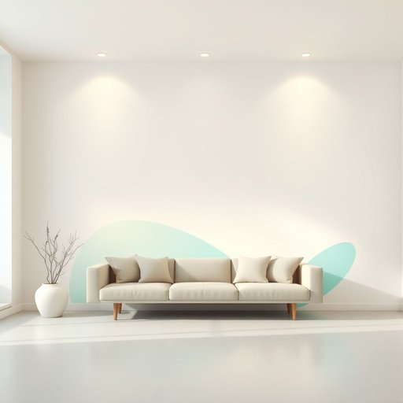

# mural

<h1 style="font-size: 2.5em; font-weight: 300; letter-spacing: 2px; margin: 0; color: #2c3e50;">
/mˈjʊrəl/
</h1>

---

---

## 例句

The mural that we decided to commission for the living room, which features a vibrant blend of abstract shapes and subtle shades of blue and green, not only transforms the entire space by adding a striking focal point but also reflects our shared love for contemporary art, making it a perfect complement to the minimalist furniture and soft lighting we installed last month.

*The(/ðə/) mural(/mˈjʊrəl/) that(/ðət/) we(/wi/) decided(/ˌdɪˈsaɪdɪd/) to(/tɪ/) commission(/kəˈmɪʃən/) for(/fər/) the(/ðə/) living(/ˈlɪvɪŋ/) room,(/rum,/) which(/wɪʧ/) features(/ˈfiʧərz/) a(/ə/) vibrant(/ˈvaɪbrənt/) blend(/blɛnd/) of(/əv/) abstract(/ˈæbˌstrækt/) shapes(/ʃeɪps/) and(/ənd/) subtle(/ˈsətəl/) shades(/ʃeɪdz/) of(/əv/) blue(/blu/) and(/ənd/) green,(/grin,/) not(/nɑt/) only(/ˈoʊnli/) transforms(/trænsˈfɔrmz/) the(/ðə/) entire(/ɪnˈtaɪər/) space(/speɪs/) by(/baɪ/) adding(/ˈædɪŋ/) a(/ə/) striking(/ˈstraɪkɪŋ/) focal(/ˈfoʊkəl/) point(/pɔɪnt/) but(/bət/) also(/ˈɔlsoʊ/) reflects(/rɪˈflɛkts/) our(/ɑr/) shared(/ʃɛrd/) love(/ləv/) for(/fər/) contemporary(/kənˈtɛmpərˌɛri/) art,(/ɑrt,/) making(/ˈmeɪkɪŋ/) it(/ɪt/) a(/ə/) perfect(/ˈpərˌfɪkt/) complement(/ˈkɑmpləmənt/) to(/tɪ/) the(/ðə/) minimalist(/ˈmɪnəməlɪst/) furniture(/ˈfərnɪʧər/) and(/ənd/) soft(/sɔft/) lighting(/ˈlaɪtɪŋ/) we(/wi/) installed(/ˌɪnˈstɔld/) last(/læst/) month.(/mənθ./)*

**翻译：** 我们为客厅委托创作的壁画，融合了抽象形状的鲜明色彩和蓝绿色的柔和色调，不仅通过增添醒目的视觉焦点彻底改造了整个空间，还体现了我们对当代艺术的共同热爱，完美契合了上个月安装的极简家具和柔和灯光。

---

## 解释

“mural”作为名词在家居生活用品的英语语境中，通常指直接绘制或贴附在墙面上的大型装饰画或壁画，常见于客厅、卧室或大厅的墙壁装饰，用以增添艺术氛围或个性化空间。这一词汇多用于描述尺寸较大、整体覆盖墙面或某部分墙面的艺术作品，使用时常见搭配有“mural painting”（壁画）、“wall mural”（墙面壁画）或“decorative mural”（装饰性壁画），语法上作为可数名词出现时应注意单复数形式“mural/murals”，且常与描述位置或主题的词组合。词源方面，“mural”来自拉丁语“muralis”，意为“墙的”，其根源“murus”即“墙”，体现了其与墙壁直接关联的属性。在中文语境中，mural准确翻译为“壁画”，特指绘制或粘贴于墙体表面的艺术画作，与普通“画”或“挂画”区别明显，强调的是与墙体的结合和空间的装饰功能。需注意的是，mural一般带有正面积极的艺术价值和文化内涵，较少有负面含义，且在现代家居环境中，壁画作为个性化和艺术氛围营造的象征，通常具有欣赏性和装饰性的褒义色彩。

---

<small style="color: #999; font-size: 0.9em;">2025-07-17 06:22:40</small>

