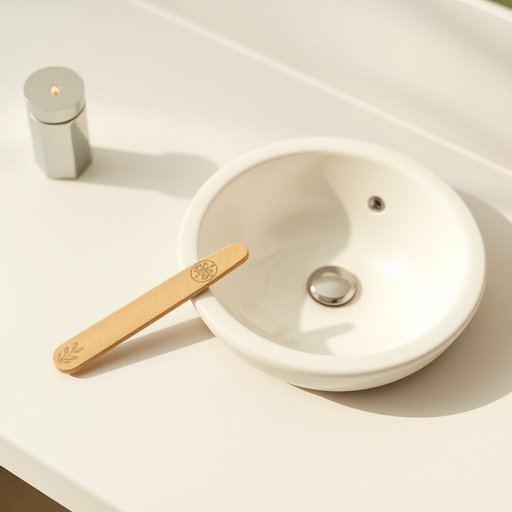

# nail-file

<h1 style="font-size: 2.5em; font-weight: 300; letter-spacing: 2px; margin: 0; color: #2c3e50;">
/nail-file*/
</h1>

---

---

## 例句

Could you please pass me the nail-file that’s tucked away in the drawer by the bathroom sink, the one with the floral pattern on the handle, because I need to smooth down the rough edges on my nails before heading out to the dinner party tonight?

*Could(/kʊd/) you(/ju/) please(/pliz/) pass(/pæs/) me(/mi/) the(/ðə/) nail-file(/nail-file*/) that’s(/that’s*/) tucked(/təkt/) away(/əˈweɪ/) in(/ɪn/) the(/ðə/) drawer(/drɔr/) by(/baɪ/) the(/ðə/) bathroom(/ˈbæθˌrum/) sink,(/sɪŋk,/) the(/ðə/) one(/wən/) with(/wɪθ/) the(/ðə/) floral(/ˈflɔrəl/) pattern(/ˈpætərn/) on(/ɔn/) the(/ðə/) handle,(/ˈhændəl,/) because(/bɪˈkəz/) I(/aɪ/) need(/nid/) to(/tɪ/) smooth(/smuð/) down(/daʊn/) the(/ðə/) rough(/rəf/) edges(/ˈɛʤɪz/) on(/ɔn/) my(/maɪ/) nails(/neɪlz/) before(/ˌbiˈfɔr/) heading(/ˈhɛdɪŋ/) out(/aʊt/) to(/tɪ/) the(/ðə/) dinner(/ˈdɪnər/) party(/ˈpɑrti/) tonight?(/təˈnaɪt?/)*

**翻译：** 你能把浴室水槽旁抽屉里藏着的那把指甲锉递给我吗？就是那把把手上带有花纹的，因为我需要在今晚去晚宴之前把指甲边缘磨平。

---

## 解释

英语单词“nail-file”作为名词，指的是一种用来修整和打磨指甲边缘的工具，通常在家居生活用品类别中出现，广泛运用于个人护理和美容场合，如洗手间、化妆台或美容沙龙。英语学习者使用该词时需注意其构成是复合名词，书写时通常用连字符连接，表示“指甲锉”，且常见搭配有“metal nail-file”（金属指甲锉）、“emery nail-file”（浮石指甲锉）等，表达时可用“use a nail-file to smooth the edges of your nails”来说明用途。该词源自“nail”（指甲）和“file”（锉刀、锉磨工具），其中“file”源自古英语“fīl”，意指用以磨平或修整的工具，组合形成指专门针对指甲使用的锉刀。中文中，“nail-file”准确翻译为“指甲锉”或“指甲挫”，强调其用于指甲边缘修饰的功能，没有特殊褒贬含义，也无明显文化色彩，仅作为个人卫生和美容的常用工具出现，适合用在日常口语和书面表达中，是描述个人护理细节时的常见词汇。

---

<small style="color: #999; font-size: 0.9em;">2025-07-17 06:22:40</small>

