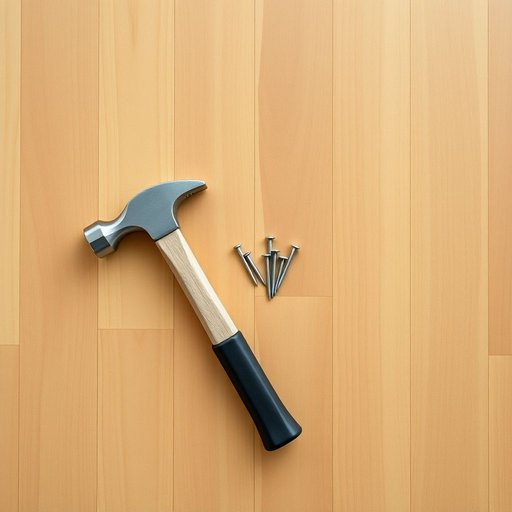

# nail

<h1 style="font-size: 2.5em; font-weight: 300; letter-spacing: 2px; margin: 0; color: #2c3e50;">
/neɪl/
</h1>

---

---

## 例句

Could you please pass me the hammer and a few extra nails from the toolbox, especially those long, thin nails that are ideal for securing the wobbly shelf we installed last weekend in the living room?

*Could(/kʊd/) you(/ju/) please(/pliz/) pass(/pæs/) me(/mi/) the(/ðə/) hammer(/ˈhæmər/) and(/ənd/) a(/ə/) few(/fju/) extra(/ˈɛkstrə/) nails(/neɪlz/) from(/frəm/) the(/ðə/) toolbox,(/ˈtulˌbɔks,/) especially(/əˈspɛʃəli/) those(/ðoʊz/) long,(/lɔŋ,/) thin(/θɪn/) nails(/neɪlz/) that(/ðət/) are(/ər/) ideal(/aɪˈdil/) for(/fər/) securing(/sɪˈkjʊrɪŋ/) the(/ðə/) wobbly(/ˈwɑbəli/) shelf(/ʃɛlf/) we(/wi/) installed(/ˌɪnˈstɔld/) last(/læst/) weekend(/ˈwiˌkɪnd/) in(/ɪn/) the(/ðə/) living(/ˈlɪvɪŋ/) room?(/rum?/)*

**翻译：** 请把工具箱里的锤子和几颗额外的钉子递给我，尤其是那些又长又细的钉子，它们非常适合固定我们上周末在客厅安装的那个晃动的搁板。

---

## 解释

英语单词“nail”作为名词，在家居生活用品的语境中主要指的是用来固定木材或其他材料的金属钉子，常见于家具组装、装修、木工等场合，如“hammer and nails”（锤子和钉子）、“drive a nail”（钉钉子）等表达。英语学习者在使用时应注意，“nail”作为可数名词，复数形式为“nails”，且通常与工具动词“hammer”或“drive”搭配使用，此外，常见短语有“pull out a nail”（拔钉子），“bend a nail”（钉子弯曲）等，表达较为具体且实用。从语法角度，需明确其为具体物体的可数名词，不能用于指代抽象概念，也不宜与不可数名词混淆。词源上，“nail”起源于古英语“nagl”，与其它日耳曼语系语言中的对应词有亲缘关系，反映了钉子作为基础工具在历史上的普遍使用。中文语境中，“nail”准确翻译为“钉子”，该词在日常生活中无褒贬色彩，属于中性词，描述的是一种常见的家用小物件，文化内涵主要体现在其实用功能和家庭装修中的重要地位，因此，准确理解和使用“nail”有助于更好地描述和参与家居生活相关的英语交流。

---

<small style="color: #999; font-size: 0.9em;">2025-07-17 06:22:40</small>

