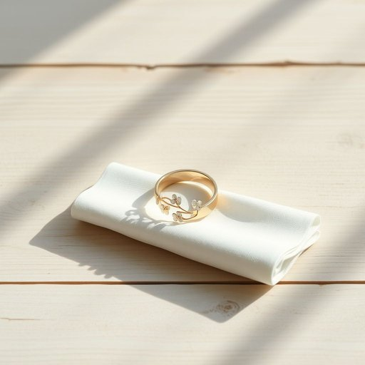

# napkin-ring

<h1 style="font-size: 2.5em; font-weight: 300; letter-spacing: 2px; margin: 0; color: #2c3e50;">
/napkin-ring*/
</h1>

---

---

## 例句

Could you please pass me the napkin-ring with the delicate floral pattern, the one Mum bought last autumn, so I can set the table properly before our guests arrive this evening?

*Could(/kʊd/) you(/ju/) please(/pliz/) pass(/pæs/) me(/mi/) the(/ðə/) napkin-ring(/napkin-ring*/) with(/wɪθ/) the(/ðə/) delicate(/ˈdɛləkət/) floral(/ˈflɔrəl/) pattern,(/ˈpætərn,/) the(/ðə/) one(/wən/) Mum(/məm/) bought(/bɔt/) last(/læst/) autumn,(/ˈɔtəm,/) so(/soʊ/) I(/aɪ/) can(/kən/) set(/sɛt/) the(/ðə/) table(/ˈteɪbəl/) properly(/ˈprɑpərli/) before(/ˌbiˈfɔr/) our(/ɑr/) guests(/gɛsts/) arrive(/əraɪv/) this(/ðɪs/) evening?(/ˈivnɪŋ?/)*

**翻译：** 请把那只带有精致花卉图案的餐巾环递给我，就是妈妈去年秋天买的那只，好让我在今晚客人到来之前把餐桌摆放妥当。

---

## 解释

napkin-ring作为名词，指的是餐巾环，即用来固定和装饰餐巾的一种环状物，通常用于正式或精致的餐桌布置中，帮助保持餐巾折叠整齐，增加餐桌的美观度，具体使用场合多见于家庭聚餐、宴会、餐厅或酒店的餐桌设置中，尤其是在需要体现礼仪和装饰效果时，英语学习者在使用napkin-ring时应注意它通常作为可数名词出现，复数形式为napkin rings，且多与set（套装）、silver（银制）、decorative（装饰性的）等形容词搭配，如a set of silver napkin rings或decorative napkin rings，此外，napkin ring作为复合名词时，两个部分连写或用连字符连接的形式均可，但连字符形式更常见，词源上，napkin来自中世纪英语，意为小餐巾，而ring指环形物，napkin-ring即字面意义上的餐巾环，最早出现在18世纪，用以方便餐巾管理和装饰，中文语境中，准确翻译为餐巾环，其核心含义简单明了，无特殊褒贬或文化色彩，但因其多用于正式场合，体现了一定的生活品味和礼仪要求，故常与优雅、精致相关联。

---

<small style="color: #999; font-size: 0.9em;">2025-07-17 06:22:40</small>

